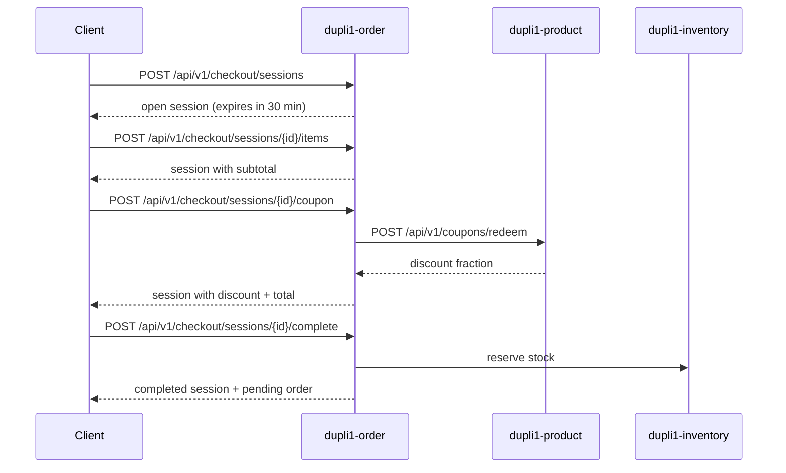

# Checkout Session

Checkout sessions provide a multi-step purchase flow inside the **order service** (`dupli1-order`). A client builds a cart-like session, optionally applies a coupon, then completes checkout to create a pending order with inventory reserved.

Direct order creation (`POST /api/v1/orders`) remains available for callers that already have a finalized cart.

## Flow



## Session states

| Status | Meaning |
|--------|---------|
| `open` | Session accepts item and coupon changes |
| `completed` | Checkout finished; `order_id` is set |
| `expired` | `expires_at` passed; session is read-only |

Default TTL is **30 minutes** (`domain.DefaultCheckoutTTL`).

## API

Base path: `/api/v1/checkout/sessions` on `dupli1-order` (port **8083** locally).

### `POST /api/v1/checkout/sessions`

Create an empty checkout session.

**Request**
```json
{ "customer_id": "03f95d58-4840-46d4-9c92-fe48364d2e75" }
```

**Response `201`**
```json
{
  "id": "cs_000001",
  "customer_id": "03f95d58-4840-46d4-9c92-fe48364d2e75",
  "items": [],
  "status": "open",
  "subtotal_cents": 0,
  "discount_cents": 0,
  "total_cents": 0,
  "expires_at": "2026-06-21T12:30:00Z",
  "created_at": "2026-06-21T12:00:00Z",
  "updated_at": "2026-06-21T12:00:00Z"
}
```

---

### `GET /api/v1/checkout/sessions/{id}`

Fetch the current session. Expired open sessions are marked `expired` on read.

**Response `200`** — session object (same shape as above, with items when present).

---

### `PUT /api/v1/checkout/sessions/{id}/items`

Replace all line items.

**Request**
```json
{
  "items": [
    { "sku": "bag-1", "quantity": 2, "unit_price_cents": 5000 }
  ]
}
```

**Response `200`** — updated session with recalculated `subtotal_cents` and `total_cents`.

---

### `POST /api/v1/checkout/sessions/{id}/items`

Add or update a single line item (matched by `sku`).

**Request**
```json
{ "sku": "bag-1", "quantity": 1, "unit_price_cents": 7500 }
```

**Response `200`** — updated session.

---

### `DELETE /api/v1/checkout/sessions/{id}/items/{sku}`

Remove a line item.

**Response `200`** — updated session.

---

### `POST /api/v1/checkout/sessions/{id}/coupon`

Apply a coupon by redeeming it from the product service.

**Request**
```json
{ "code": "SUMMER30" }
```

**Response `200`** — session with `coupon_code`, `discount_cents`, and `total_cents` updated.

Requires `DUPLI1_PRODUCT_URL` to be configured. Returns `503` when the coupon client is unavailable.

---

### `POST /api/v1/checkout/sessions/{id}/complete`

Finalize checkout: reserve inventory, create a `pending` order, and mark the session `completed`.

**Response `200`**
```json
{
  "session": {
    "id": "cs_000001",
    "status": "completed",
    "order_id": "ord_000001",
    "coupon_code": "SUMMER30",
    "subtotal_cents": 10000,
    "discount_cents": 3000,
    "total_cents": 7000
  },
  "order": {
    "id": "ord_000001",
    "customer_id": "03f95d58-4840-46d4-9c92-fe48364d2e75",
    "status": "pending",
    "coupon_code": "SUMMER30",
    "subtotal_cents": 10000,
    "discount_cents": 3000,
    "total_cents": 7000,
    "items": [
      { "sku": "BAG-1", "quantity": 2, "unit_price_cents": 5000 }
    ]
  }
}
```

After completion, use the existing order APIs to confirm, cancel, or fulfill the order.

## Configuration

| Variable | Default | Description |
|----------|---------|-------------|
| `DUPLI1_ORDER_ADDR` | `:8083` | Listen address |
| `DUPLI1_INVENTORY_URL` | `http://localhost:8082` | Inventory reservation API |
| `DUPLI1_PRODUCT_URL` | `http://localhost:8081` | Coupon redemption API |

## Errors

| Status | Condition |
|--------|-----------|
| `400` | Invalid input, empty checkout, expired session, invalid coupon |
| `404` | Session not found |
| `503` | Coupon service not configured |
| `500` | Inventory or persistence failure |

## Package layout

| Path | Role |
|------|------|
| `order/pkg/domain/checkout_session.go` | Session entity and totals logic |
| `order/pkg/service/checkout.go` | Use cases |
| `order/pkg/ports/repository.go` | Order and checkout session persistence |
| `order/pkg/ports/coupon.go` | Coupon redemption port |
| `order/pkg/infra/httpcoupon/` | Product service HTTP adapter |
| `order/pkg/handler/checkout.go` | HTTP routes |

Order and checkout routes require `Authorization: Bearer <token>` when `JWT_SECRET` is configured. See [current-state.md](current-state.md) for the RS256 alignment gap with auth.
