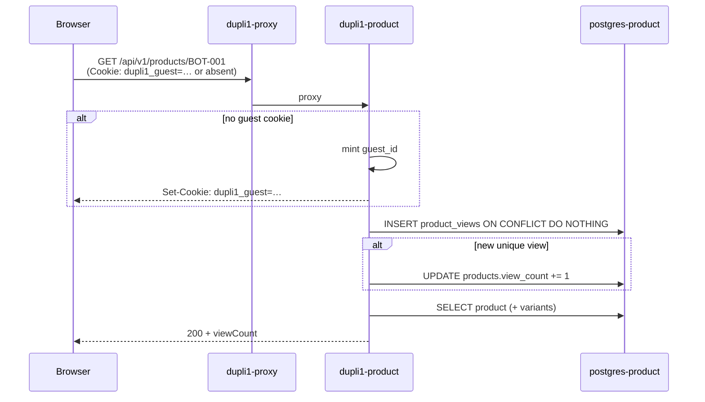

# Plan: Guest Session Cookie + Unique Product View Counter

**Status:** Phase 1 implemented (guest cookie + unique PDP views).  
**Related:** [cart-service.md](cart-service.md) (guest cart phase 2), [current-state.md](current-state.md), [api.md](api.md) (`GET /api/v1/products/{id}`), [product-recommendations.md](product-recommendations.md) (recommendations consume `view_count` / co-view).

## Goals

1. Give every browser a stable **anonymous guest identity** via an HttpOnly cookie.
2. Count **unique product page views** per parent product (one count per guest × product, not every refresh).
3. Design the guest cookie so **guest cart / merge-on-login** can reuse it later without a second identity.

Non-goals for this plan:

- Full analytics warehouse / funnels / sessions replay
- Counting authenticated users separately from guests (same cookie still works while logged in)
- Bot-proof fraud scoring (light heuristics only)
- Changing JWT auth or creating auth DB users for guests

## Current state

| Piece | Today |
|-------|--------|
| `GET /api/v1/products/{id}` | Public PDP; no view side effects |
| Product domain | No `viewCount` / view tables |
| Auth cookies | Options exist (`CookieName=dupli1_session`, Secure/HttpOnly) for refresh sessions; **no guest cookie** |
| Cart | JWT-only; guest cart **not started** |
| Redis | Wired to **auth** only in Compose/ECS |
| Storefront ↔ API | Production ALB: `dupli1.com` serves web (`/*`) and API (`/api/*`) — **same site**, so first-party cookies work without credentialed CORS |

## Design summary

```text
Browser
  Cookie: dupli1_guest=<opaque-id>   (HttpOnly, Secure, SameSite=Lax, Path=/, long Max-Age)
       │
       ▼
GET /api/v1/products/{id}   (dupli1-product)
  1. Read cookie; if missing → mint ULID/UUID, Set-Cookie
  2. Upsert unique view (guest_id, product_id)
  3. Return PDP JSON including viewCount (denormalized)
```

Guest id is **not** a JWT `sub` and is **not** stored in `auth.users`. It is an opaque browser id shared across services by cookie convention.

## Cookie contract

| Attribute | Value | Rationale |
|-----------|--------|-----------|
| Name | `dupli1_guest` | Distinct from auth’s `dupli1_session` (refresh) |
| Value | opaque ULID or UUID (no PII) | Stable, unguessable enough for uniqueness |
| `HttpOnly` | `true` | JS cannot steal; storefront does not need to read it |
| `Secure` | `true` in prod; configurable locally | HTTPS on ALB |
| `SameSite` | `Lax` | Sent on top-level navigations + same-site XHR/fetch |
| `Path` | `/` | Available to all `/api/*` services behind the gateway |
| `Max-Age` / `Expires` | ~365 days | Long-lived identity for unique views + future guest cart |
| `Domain` | omit (host-only) on `dupli1.com` | ALB same-host routing; avoid over-scoping |

**Local Compose caveat:** if the storefront runs on a different origin than the gateway (`localhost:3000` → `localhost:8080`), the browser will not send the cookie on cross-origin fetches unless the API sets CORS `Access-Control-Allow-Credentials` and a matching `Access-Control-Allow-Origin` (not `*`). Prefer same-origin via the gateway (or a Next.js rewrite) in local web config when implementing.

**Do not** put the guest id in `localStorage` as the primary id — cookie is the source of truth so all services see the same value.

## Where the cookie is minted

**Recommendation: mint in `dupli1-product` on PDP (and later any guest-aware route), using a tiny shared helper.**

| Option | Pros | Cons |
|--------|------|------|
| **A. Product on PDP** (chosen for phase 1) | Minimal surface; views need the cookie anyway | Cart must also mint if hit before any PDP |
| B. Dedicated `POST /api/v1/auth/guest` | Central issuance | Auth owns anonymous commerce identity; extra round trip |
| C. Nginx `add_header Set-Cookie` | Central | Hard to generate secure ids; awkward TTL refresh |

Phase 1 implements **A**. Phase 2 (guest cart) reuses the same cookie name/attrs; cart mints if absent on first cart mutation. Extract shared cookie parse/set helpers into `shared/` only when a second service needs them (avoid premature shared package churn).

## Unique view semantics

**Unit of count:** parent product id (`products.id`, e.g. `BOT-001`), not variant SKU. PDP is parent-scoped today.

**Uniqueness key:** `(guest_id, product_id)` — first view counts; reloads and revisits by the same browser do not.

**When to record:** on successful public `GET /api/v1/products/{id}` (product found and returned). Do **not** count:

- `404` / draft-hidden public misses
- List/search (`GET /api/v1/products`)
- Variant-only endpoints
- Optional later: requests with `product.read` (managers) if admin traffic inflates counts — start by counting everyone; add an opt-out flag if needed

**Failure mode:** view recording must not fail the PDP. If the view upsert errors, log and still return the product (stale or zero `viewCount`).

### Data model (product DB)

```sql
CREATE TABLE IF NOT EXISTS product_views (
    guest_id    TEXT NOT NULL,
    product_id  TEXT NOT NULL REFERENCES products(id) ON DELETE CASCADE,
    first_seen_at TIMESTAMPTZ NOT NULL DEFAULT NOW(),
    PRIMARY KEY (guest_id, product_id)
);

CREATE INDEX IF NOT EXISTS product_views_product_id_idx
    ON product_views (product_id);

ALTER TABLE products
    ADD COLUMN IF NOT EXISTS view_count BIGINT NOT NULL DEFAULT 0;
```

**Write path (transaction):**

1. `INSERT INTO product_views (guest_id, product_id) VALUES ($1, $2) ON CONFLICT DO NOTHING`
2. If a row was inserted → `UPDATE products SET view_count = view_count + 1 WHERE id = $2`
3. Read product (existing path) — `view_count` already on the row

This gives **exact** unique counts with O(1) reads on PDP (no `COUNT(*)` per request).

### Why not Redis-only?

| Approach | Fit |
|----------|-----|
| Postgres unique + denormalized counter | Matches product’s existing DB; exact; survives Redis absence; good for phase 1 |
| Redis `SET` / HyperLogLog | Fast; product has no Redis today; HyperLogLog is approximate |
| Auth Redis from product | Couples product to auth infra |

Revisit Redis (or HyperLogLog) only if write volume on PDP becomes a bottleneck.

## API / JSON

Extend public PDP response:

```json
{
  "id": "BOT-001",
  "name": "…",
  "viewCount": 1284,
  "variants": [ … ]
}
```

| Field | Visibility |
|-------|------------|
| `viewCount` | Public on `GET /api/v1/products/{id}` (social proof) |
| Per-guest history | Not exposed |
| Aggregate admin reports | Future (analytics package); not in this plan |

Search/list may omit `viewCount` initially (or include later for “popular” sort — out of scope).

**Set-Cookie** on the PDP response when minting or refreshing TTL (sliding Max-Age optional; fixed Max-Age is simpler for v1).

## Sequence



## Service layout (implementation sketch)

Follow existing hexagonal layout in `product/`:

| Layer | Responsibility |
|-------|----------------|
| `handler` | Read/write `dupli1_guest` cookie; call view service then existing get-product |
| `service` | `RecordUniqueView(guestID, productID)`; ignore duplicate; never fail PDP |
| `ports` | `ProductViewStore` |
| `infra/pg` | Migrate tables; upsert + increment |
| `infra/memory` | In-memory set for tests |
| `domain` | Optional: `ViewCount` on `Product` JSON tag `viewCount` |

Config flags (product `options`):

- `GUEST_COOKIE_NAME` (default `dupli1_guest`)
- `GUEST_COOKIE_SECURE` / `GUEST_COOKIE_HTTP_ONLY` / `GUEST_COOKIE_MAX_AGE`
- `PRODUCT_VIEWS_ENABLED` (default true) for kill-switch

## Privacy & security

- Guest id is a random opaque token — treat like a session secret (HttpOnly, Secure).
- No IP logging required for uniqueness; do not store IP in `product_views` for v1.
- Cookie is not evidence of consent for marketing cookies; it is strictly functional (cart/views). Confirm with product/legal if a banner is required in your jurisdiction.
- Rate-limit is not required for correctness; optional later to blunt view inflation from scripted cookie rotation (each new cookie can inflate counts — accept for v1 or add soft per-IP caps later).

## Phased delivery

### Phase 1 — Guest cookie + unique PDP views (this plan)

1. Schema: `product_views` + `products.view_count`
2. Cookie mint/parse on `PublicGetProduct`
3. Unique upsert + denormalized increment
4. Expose `viewCount` on PDP JSON
5. Unit/integration tests (memory + pg if available): first view increments; second does not; missing cookie sets cookie; PDP still 200 if view store fails
6. Docs: `api.md`, `endpoints.md`, `current-state.md`

### Phase 2 — Guest cart (separate work)

- Cart accepts `dupli1_guest` when no Bearer token; key carts by `guest:<id>` or dedicated column
- Merge into JWT `sub` cart on login
- See [cart-service.md](cart-service.md) planned enhancements

### Phase 3 — Optional analytics

- Admin “top viewed” queries / events on NATS
- Exclude staff, bot UA filtering, daily rollups

### Downstream — Recommendations

Unique views unlock popularity ranking and optional co-view boosts for PDP “You may also like”. See [product-recommendations.md](product-recommendations.md) and [product-views-recommendations-plan.md](product-views-recommendations-plan.md) (phase 0 = this plan’s phase 1).

## Frontend notes (`dupli1-web`)

- Prefer calling PDP through same origin (`/api/v1/products/...`) so the cookie is first-party.
- Use `credentials: 'same-origin'` (default for same-origin `fetch`); do not switch to opaque cross-origin without CORS credentials work.
- Display `viewCount` only if product wants social proof on PDP; field can exist unused.
- No client-side guest id generation.

## Open decisions (defaults chosen)

| Question | Default |
|----------|---------|
| Count unit | Parent product id |
| Exact vs approximate | Exact (Postgres) |
| Public `viewCount` | Yes on PDP |
| Cookie name | `dupli1_guest` |
| Mint location | Product PDP (phase 1) |
| Logged-in users | Same guest cookie (views stay browser-unique) |
| Manager traffic | Count for now |

## Acceptance criteria (phase 1)

- [x] First anonymous PDP load sets `dupli1_guest` and increments `viewCount` by 1
- [x] Reload / second GET with same cookie does not increment
- [x] Different cookie increments again
- [x] Product delete cascades view rows
- [x] View-store failure still returns product `200`
- [x] Compose + tests cover happy path without requiring Redis
