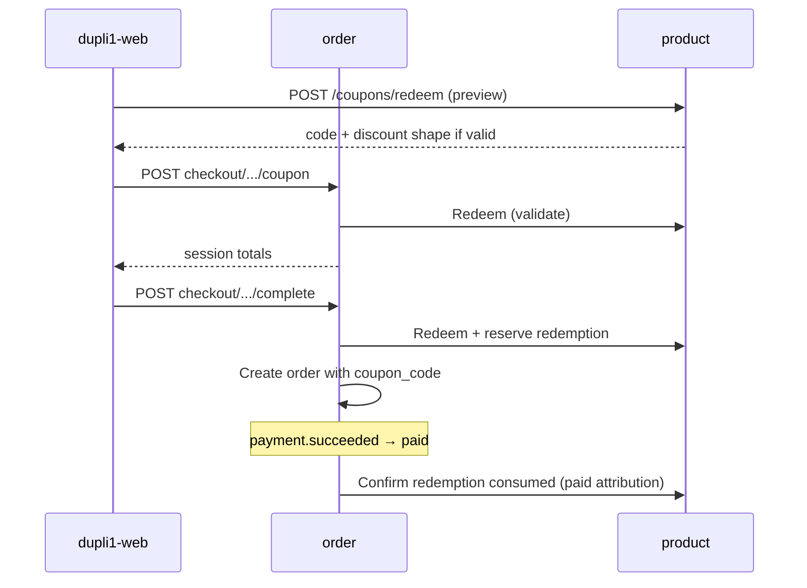
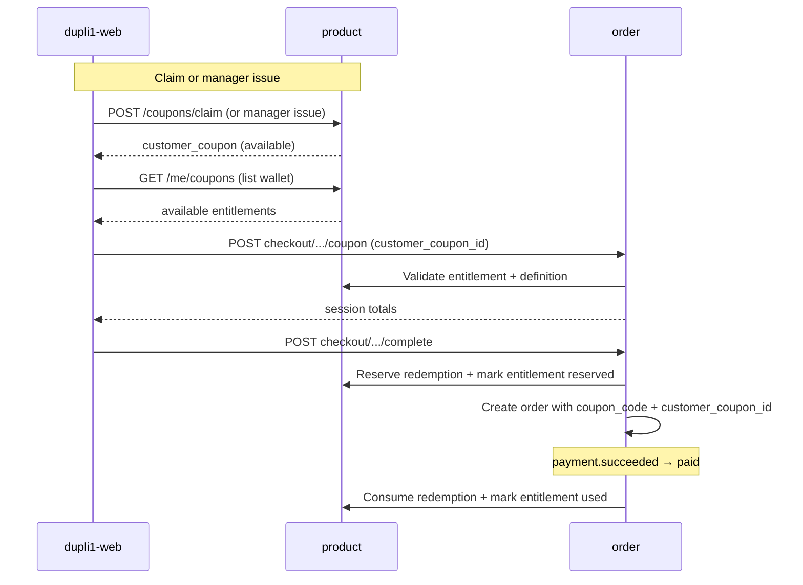

# Coupon / sales-trackable referral code plan

**Status:** Planning (2026-08-31; two-type model clarified 2026-09-13) — not started. Target **v1.2+** commerce (after v1.0 / v1.1 platform slices).  
**Repos:** `dupli1` (product, order), `dupli1-web`, `dupli1-manage-web`.  
**Related:** [checkout-session.md](checkout-session.md), [api.md](api.md) (coupons + checkout), [payment-service.md](payment-service.md), [permissions.md](permissions.md), [v1.1-release-plan.md](v1.1-release-plan.md) (commerce deferred to v1.2), [TODO.md](TODO.md).

## Goal

One promo system that can **discount**, **attribute sales**, or **both** — and that customers can obtain in **two first-class ways**:

1. **Code-based** — enter a shareable code at cart/checkout.
2. **Account-registered** — a coupon held on the customer account (claimed or issued), then selected for use at checkout.

Marketing coupons, partner/influencer referral codes, and personal issued coupons share the same discount math and order fields (`coupon_code` / `discount_krw`).

## Two coupon types

| | **Code-based** | **Account-registered** |
|--|----------------|------------------------|
| How the customer gets it | Knows / is given a string code | Coupon is on their account (claim code into wallet, or manager/system issues it) |
| How they use it | Type code in cart/checkout promo field | Pick from profile / checkout wallet list |
| Identity on the order | `coupon_code` (the entered code) | Still snapshot `coupon_code` (template code) + optional `customer_coupon_id` for the entitlement |
| Typical use | Campaigns, influencers, printed codes | Welcome / apology / VIP / claimed personal coupons |
| Guest usable? | Yes (once guest checkout exists) | No — requires authenticated customer |
| Storefront today | Cart/checkout promo field → redeem + apply | Profile “Coupons” UI exists but is **client-local stub** (`COUPONS = []`) |

**Both types are in scope** for this plan. They are distribution / possession modes over the same promo definition — not two services and not two discount engines.

A single definition may allow one or both modes via `distribution`:

| `distribution` | Meaning |
|----------------|---------|
| `code` | Enter at checkout only (no wallet row required) |
| `account` | Must be registered to the account; checkout selects entitlement (typing the public code at checkout is rejected or treated as claim-only) |
| `both` | Enter at checkout **or** claim into wallet then select (default for simple campaign codes that also appear in “My coupons”) |

## Verdict

**Do not build a separate referral service.** Extend the existing product coupon + order `coupon_code` / `discount_krw` path into a **promo code** model with:

1. Hardened coupon rules (real expiry, usage limits, redemption ledger).
2. **Account wallet entitlements** (server-side), replacing the storefront profile stub.
3. Optional **partner / campaign attribution** for sales reporting (GMV + order count by code).
4. Optional **zero-discount** codes (track-only referral) and **discount + track** hybrid codes.

Customer-facing UX keeps calling them “promo / coupon”; admin reports distinguish discount vs referral campaigns and code vs account issuance.

## What already works

| Layer | Behavior |
|-------|----------|
| Product `coupons` | `code`, `discount` (fraction), `description`, `expires` (free-text), `active` — PG + memory; seed `SUMMER30` |
| Redeem | `POST /api/v1/products/coupons/redeem` (and legacy `/api/v1/coupons/redeem`) — **lookup only**; does not consume uses or register to an account |
| Order checkout | `POST …/checkout/sessions/{id}/coupon` → product redeem → `coupon_code` + `%` of subtotal as `discount_krw` |
| Order row | Immutable `coupon_code` / `discount_krw` / `total_krw` on create; pricing server-side |
| manage-web | `/coupons` CRUD (code, %, description, expires, active toggle) |
| Storefront (code) | Cart/checkout promo field; validates via redeem; applies via `applySessionCoupon` before complete |
| Storefront (account) | Profile Coupons section: enter code → local list only; **not persisted**, lost on refresh |
| Permissions | `coupon.read|create|update|delete` / `coupon.*` (catalog_editor bundle) |

## Problem

Today’s coupons are **catalog labels with a percentage**, not a commerce instrument:

1. **No usage accounting** — redeem never increments a counter; unlimited global use.
2. **Expiry not enforced** — `expires` is display text (`"Aug 31, 2026"`); `GetActive` only checks `active`.
3. **Discount shape is narrow** — fraction only (`0 < f < 1`); no fixed KRW off, min spend, max discount, or SKU/brand scope.
4. **No sales reporting by code** — orders store `coupon_code`, but there is no aggregate API or admin report (orders × GMV × paid status).
5. **No partner / referrer identity** — cannot answer “how much did code `YUNA10` drive?” beyond grepping orders.
6. **Account-registered path is missing** — profile UI implies claim-to-account, but there is no server wallet, issue API, or checkout “select from my coupons”.
7. **Referral is missing** — zero-discount attribution codes and partner payouts are out of scope of the current model.

Building a standalone “referral” microservice would duplicate the checkout apply path and leave coupon gaps unfixed. Treating account coupons as a separate product without sharing definitions/ledger would duplicate discount rules.

## Product question (coupon vs referral)

| Need | Coupon-only | Referral-only | **Unified promo (recommended)** |
|------|-------------|---------------|----------------------------------|
| % or ₩ off at checkout | Yes | Optional | Yes (`discount_*`) |
| Track who drove the order | Weak (code string only) | Yes | Yes (`partner_id` / campaign) |
| Track-only (no discount) | Awkward (`discount=0` rejected today) | Yes | Yes (`kind=referral` or `discount=0` allowed) |
| Manager CRUD in one place | Already `/coupons` | New UI | Extend `/coupons` + reports |
| Checkout / payment path | Already wired | New wire | Reuse existing apply + order fields |
| Code vs account possession | Partial (code only) | N/A | Yes (`distribution` + wallet) |

**Recommendation:** unified promo definitions. “Referral” is a **kind / campaign mode**. “Code vs account” is a **distribution / possession mode**. Neither needs a second code namespace or service.

## Decisions

| Decision | Choice |
|----------|--------|
| Ownership of code definitions | **Product** (existing `coupons` table / CRUD) — rename conceptually to *promo codes*; keep HTTP paths `/products/coupons` for compatibility |
| Ownership of account entitlements | **Product** — `customer_coupons` (or equivalent) next to definitions + redemption ledger so caps and expiry stay one place. Profile UI is presentation only; do not put the ledger in `profile` |
| Ownership of applied code on purchase | **Order** — keep `coupon_code` + `discount_krw` on session/order (stable wire names); optional `customer_coupon_id` when applied from wallet |
| Two types | **Both required:** code-based apply path (exists) + account-registered wallet (new). Still **one** discount per checkout session |
| How account coupons are created | (a) customer **claims** an eligible code into wallet; (b) manager **issues** to `customer_id`; (c) later: system auto-issue (e.g. welcome) |
| Sales attribution moment | Count toward **paid** GMV when order becomes `paid` (payment.succeeded). Pending/canceled do not count. Ship/fulfill do not change attribution |
| Redemption / usage consume | On **checkout complete** (order create), after server re-validates — not on preview redeem, not on claim-to-wallet, not on cart |
| Track-only codes | Allowed: `discount_fraction = 0` and/or `discount_krw = 0`; session still stores `coupon_code` |
| Partner entity | Lightweight: optional `partner_id` (string ULID or slug) + display name on the code row. No payout ledger in v1 of this plan |
| Currency | KRW only; fixed discounts are whole won (`*_krw` = whole KRW) |
| Permissions | Reuse `coupon.*` for definitions; customer wallet uses ABAC (`sub` == owner). Manager issue may need `coupon.issue` (or reuse `coupon.update`) |
| Commission / influencer payout | **Out of scope** — report GMV by code/partner; finance settles offline |

## Domain model (target)

### Promo definition (product)

Extend `coupons` (additive columns; keep `code` PK):

| Field | Type | Notes |
|-------|------|-------|
| `code` | text PK | Uppercased; existing |
| `distribution` | text | `code` \| `account` \| `both` (default `both` for backward-compatible campaign codes) |
| `kind` | text | `discount` \| `referral` \| `hybrid` (default `discount`) |
| `discount_type` | text | `percent` \| `fixed` \| `none` |
| `discount` / `discount_fraction` | float | Keep existing column for percent; `0` allowed when type `none` |
| `discount_fixed_krw` | bigint | Whole KRW off when type `fixed` |
| `description` | text | Existing |
| `expires_at` | timestamptz nullable | Enforce on redeem / claim / apply; migrate away from free-text `expires` (keep `expires` as display until clients migrate) |
| `active` | bool | Existing |
| `max_redemptions` | int nullable | Global cap; null = unlimited |
| `max_per_customer` | int nullable | Per `customer_id`; null = unlimited |
| `max_claims_per_customer` | int nullable | How many wallet rows one customer may hold for this code; default 1 |
| `min_subtotal_krw` | bigint | Default 0 |
| `partner_id` | text nullable | Referrer / campaign owner |
| `partner_label` | text | Admin display |
| `redemption_count` | int | Denormalized counter (ledger is source of truth) |

Rules on validate (code redeem / claim / wallet apply) and again on checkout complete:

- `active` and (`expires_at` is null or `now < expires_at`)
- global and per-customer caps not exceeded (count **consumed** redemptions only)
- subtotal ≥ `min_subtotal_krw` (at apply / complete; claim may skip subtotal)
- discount math: percent → `floor(subtotal * fraction)` or existing int cast; fixed → `min(fixed, subtotal)`; none → `0`
- `distribution` respected: account-only codes cannot be applied by typing at checkout without an entitlement; code-only definitions do not create wallet rows on claim (or claim is rejected)

### Account entitlement (product)

```text
customer_coupons (
  id,                -- ULID
  customer_id,       -- auth user id
  code,              -- FK to coupons.code (template)
  status,            -- available | reserved | used | expired | revoked
  source,            -- claim | issue | system
  issued_by,         -- manager user id when source=issue; nullable
  expires_at,        -- snapshot or override; null = inherit definition
  created_at,
  used_order_id      -- set when consumed
)
```

| Event | Entitlement |
|-------|-------------|
| Customer claims code | Insert `available` if definition allows `account`/`both` and claim caps OK |
| Manager issues | Insert `available` (`source=issue`) |
| Checkout applies from wallet | Session stores `customer_coupon_id` + `coupon_code`; entitlement may move to `reserved` at complete |
| Order → `paid` | `used` + link `used_order_id` |
| Order → `canceled` from pending | Back to `available` (or `released` then available) |
| Past `expires_at` | `expired` (lazy or job) |

Claiming into the wallet **does not** burn a global redemption; **using at paid checkout** does (same ledger as code-based).

### Redemption ledger (product)

Prefer **order as source of applied code** + a **product redemption ledger** written when order is created (or when order becomes `paid` — see open questions):

```text
coupon_redemptions (
  id, code, order_id, customer_id,
  customer_coupon_id nullable,   -- set when applied from wallet
  discount_krw, order_subtotal_krw,
  status: reserved | consumed | released,
  created_at, paid_at nullable
)
```

| Event | Ledger |
|-------|--------|
| Checkout complete | Insert `reserved` (or `consumed` if we attribute at create); bump counters if counting at create |
| Order → `paid` | Mark `consumed` / set `paid_at`; sales report uses this |
| Order → `canceled` from pending | `released`; free the cap slot; restore account entitlement if any |

Exact reserve-vs-paid timing is an open question below; **reports always filter paid**.

### Order (unchanged wire + optional enrichment)

Keep `coupon_code`, `discount_krw`. Add optional `customer_coupon_id` when applied from wallet. Optional later: `partner_id` snapshot on the order row for reporting without joining product (denormalize at complete).

## Attribution & reporting

**Sales by code (manager):**

- Inputs: `code` or `partner_id`, date range, status filter (default `paid`+), optional `source` filter (code-typed vs wallet)
- Metrics: order count, GMV (`sum(total_krw)`), discount given (`sum(discount_krw)`), AOV, claim vs redeem mix
- API sketch: `GET /api/v1/products/coupons/{code}/stats` and/or `GET /api/v1/products/coupons/stats?partner_id=`
- manage-web: Coupons table columns + detail drawer with stats; issue-to-customer action; Orders filter by coupon code (already show code on order detail)

**Storefront:** still one promo per order. Code path: type code. Account path: select from wallet (and/or claim then select). Track-only codes still apply (no visible discount line if 0).

## Flows (target)

### Code-based



### Account-registered



## Phases

### Phase 0 — Plan + contracts (this doc)

- [x] This plan
- [x] Index in [README.md](README.md) / checklist in [TODO.md](TODO.md)
- [x] Two-type model (code-based + account-registered) recorded
- [ ] Resolve open questions (attribution consume timing, fixed discount, partner shape, account-only checkout UX)
- [ ] OpenAPI / api.md stubs for new coupon fields, wallet, stats (when implementation starts)

### Phase 1 — Harden shared definitions (product + order)

**Backend**

1. Add `expires_at`, `max_redemptions`, `max_per_customer`, `min_subtotal_krw`, `redemption_count`, `distribution` (additive migrate).
2. Enforce expiry + caps on redeem and on checkout complete re-validate.
3. Redemption ledger + release on unpaid cancel.
4. Allow `discount = 0` for track-only (adjust domain `ApplyCoupon` which today rejects `<= 0` / `>= 1`).
5. Tests: expired, capped, per-customer, cancel releases, complete recomputes discount.

**Frontends**

6. manage-web: edit new fields (including distribution); show redemption count.
7. Storefront: clearer errors (expired / limit reached) if API returns distinct codes.

### Phase 2 — Account-registered wallet (product + storefront)

1. `customer_coupons` table + claim API (`POST …/coupons/claim`) and list API (`GET …/me/coupons` or `/customers/{id}/coupons` with ABAC).
2. Manager issue API + manage-web “issue to customer”.
3. Checkout apply accepts `customer_coupon_id` (in addition to typed `coupon_code`); complete reserves/consumes entitlement.
4. Replace `dupli1-web` profile Coupons stub with server list + claim; checkout can select from wallet.
5. Tests: claim caps, account-only vs code-only distribution, cancel restores entitlement, cannot double-spend one entitlement.

### Phase 3 — Referral / partner attribution

1. Add `kind`, `partner_id`, `partner_label` on coupons.
2. Snapshot partner on order at complete (optional column).
3. Stats API: GMV / count by code and by partner (paid only).
4. manage-web: partner fields + simple report view on coupon detail.
5. Docs: living as-built note (or fold into api.md / current-state).

### Phase 4 — Richer discount shapes (optional)

1. `discount_type` + `discount_fixed_krw`.
2. Order checkout math supports fixed KRW off.
3. manage-web create/edit UI for fixed vs percent vs none.
4. (Defer) brand/SKU scope, stacking, first-order-only, auto-issue on register.

## Non-goals (this plan)

- Separate `dupli1-referral` service or NATS `referral.*` events
- Multi-code stacking on one order
- Automatic partner commission / payouts / tax
- Guest-held account coupons (account type requires login)
- Changing JSON field names away from `coupon_code` / `discount_krw`
- Formal SQL migration tooling (continue additive startup migrate)
- Putting the wallet ledger in `profile` (profile remains addresses / display profile)

## Open questions

1. **Consume on create vs paid?** Caps that free on unpaid cancel need a reserved state; simpler v1 may consume only on `paid` and accept oversell of caps under unpaid holds (5 min auto-cancel helps).
2. **Self-referral?** Block `partner_id` == purchaser, or ignore for v1?
3. **Rename admin nav** from “Coupons” to “Promo codes”? (i18n only; paths stay.)
4. **Fixed KRW in Phase 1 or 4?** Phase 1 can stay percent + none if schedule is tight.
5. **Stats from order DB vs product ledger?** Order already has `coupon_code` — product stats can query via gateway or denormalized ledger. Prefer ledger + order filter consistency.
6. **Account-only at checkout:** select-only UI, or allow typing a code that auto-claims then applies in one step when `distribution=account|both`?
7. **Default `distribution`:** `both` (backward compatible with today’s typed codes) vs `code` until wallet ships?

## Exit criteria (feature complete for Phases 1–3)

- [ ] Expired / capped codes rejected at redeem and checkout complete
- [ ] Customer can claim/list account coupons; manager can issue; checkout can apply by `customer_coupon_id`
- [ ] Track-only and hybrid codes store `coupon_code` on paid orders with correct `discount_krw`
- [ ] Manager can see redemption count and paid GMV for a code / partner
- [ ] Unpaid cancel does not permanently burn a capped redemption or wallet entitlement (if reserve model chosen)
- [ ] Tests cover product + order paths (code and account); [api.md](api.md) / [current-state.md](current-state.md) updated

## Suggested sequencing vs releases

```text
v1.0 / v1.1  — no dependency; do not block launch
v1.2+        — Phase 0–3 with other commerce UX (harden → wallet → attribution)
later        — Phase 4 as needed
```
