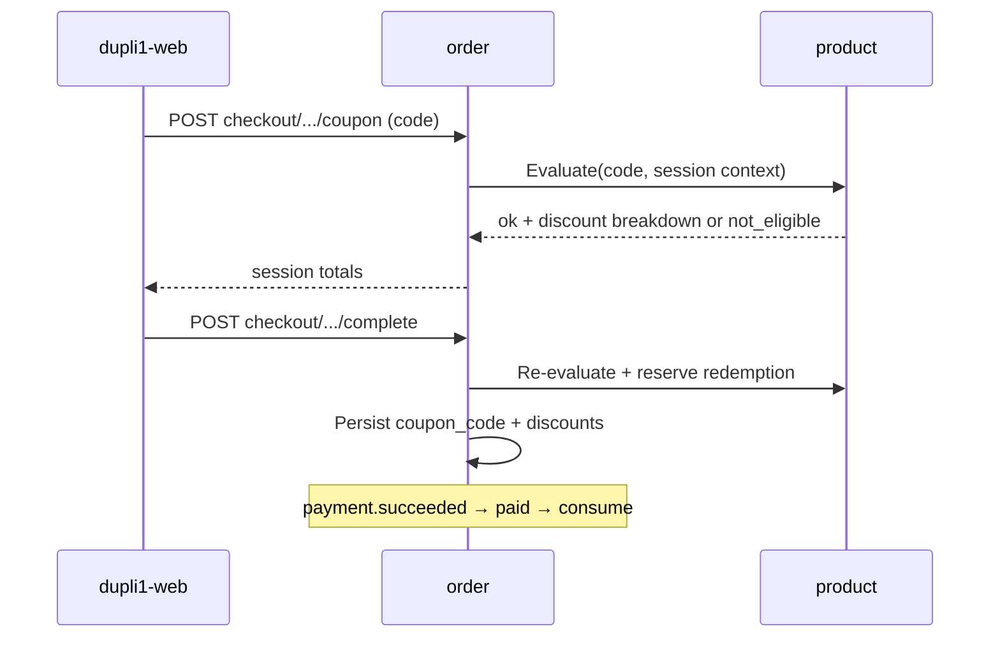

# Coupon / sales-trackable referral code plan

**Status:** Planning (2026-08-31; types + flexible conditions clarified 2026-09-13) — not started. Target **v1.2+** commerce (after v1.0 / v1.1 platform slices).  
**Repos:** `dupli1` (product, order), `dupli1-web`, `dupli1-manage-web`.  
**Related:** [checkout-session.md](checkout-session.md), [api.md](api.md) (coupons + checkout), [payment-service.md](payment-service.md), [permissions.md](permissions.md), [product-multi-category-design.md](product-multi-category-design.md), [product-attributes.md](product-attributes.md), [v1.1-release-plan.md](v1.1-release-plan.md) (commerce deferred to v1.2), [TODO.md](TODO.md).

## Goal

One promo system that can **discount**, **attribute sales**, or **both**, with:

1. **Two coupon types** by audience / use limit — **single-user one-time** and **global once-per-customer**.
2. **Flexible usage conditions** — eligibility and benefit can depend on **almost any checkout / catalog attribute** (prices, categories, shipping, brand/style/SKU, customer signals, etc.), not a fixed handful of columns.

Delivery (type code vs wallet) is a possession path, not a third type. All paths share discount math and order fields (`coupon_code` / `discount_krw`, plus optional shipping discount fields when benefit targets delivery).

## Two coupon types (product taxonomy)

| | **Single-user one-time** | **Global (everyone once)** |
|--|--------------------------|----------------------------|
| Audience | Exactly one `customer_id` | Any authenticated customer (and later guests, if guest checkout exists) |
| Use limit | That user uses it **once** | **Each** user uses it **once** (`max_per_customer = 1`) |
| Typical identity | Unique entitlement (`customer_coupons.id`); template `code` may be shared or per-issue | One public `code` (e.g. `SUMMER30`) |
| How they usually get it | Manager/system **issues** to account (welcome, apology, VIP); optional unique claim token | Know the campaign code; optionally **claim** into “My coupons” then select |
| How they use it | Select from wallet / apply bound entitlement | Type code at cart/checkout (and/or select after claim) |
| Caps | One entitlement → one consumed redemption for that user | Per-customer cap = 1; optional global `max_redemptions` for campaign budget |
| Guest usable? | No | Yes when guest checkout exists (still once per customer identity) |
| Storefront today | Profile Coupons UI stub only | Cart/checkout promo field → redeem + apply (no per-customer enforce) |

**Both types are in scope.** Same definition table + ledger; `scope` selects audience rules. **Conditions** (below) apply equally to both types.

| `scope` | Meaning | Implied defaults |
|---------|---------|------------------|
| `single_user` | One-time coupon for one account | Requires `customer_coupons` entitlement; `max_per_customer = 1` |
| `global` | Shared campaign; everyone may use once | `max_per_customer = 1`; apply by typing `code` (wallet claim optional) |

**Delivery (not a separate type):**

| Delivery | Fits |
|----------|------|
| Type `coupon_code` at checkout | **Global** (primary) |
| Account wallet (`customer_coupon_id`) | **Single-user** (primary); optional for global after claim |

## Usage conditions (flexible eligibility + benefit)

**Decision:** conditions are **first-class and flexible**. Managers can express rules over **checkout context + line/catalog attributes**, not only a hard-coded `min_subtotal`. Today’s “percent off goods subtotal, never shipping” behavior is the **default**, not the ceiling.

### Condition context (evaluated at apply + checkout complete)

Built from the checkout session / order draft:

| Area | Examples |
|------|----------|
| **Money** | Line `unit_price_krw`, line extension, `subtotal_krw`, `shipping_fee_krw`, `total_krw` before coupon, discount caps |
| **Catalog / taxonomy** | `category`, `subCategory`, `brandCode`, `styleCode`, `colorCode`, `sizeCode`, `edition`, merchandising fields, future category facets (`details.*`) |
| **Line identity** | `sku`, `skuId`, parent product id, quantity |
| **Shipping** | Flat fee amount; whether fee is present; free-shipping threshold style rules |
| **Customer** | `customer_id`, first-order / prior paid order count (when available), account age (later) |
| **Cart shape** | Item count, distinct brands/categories, only-eligible-lines subtotal |

“Almost all attributes” means: **any field order already has (or can load via product) for pricing lines** should be addressable in conditions as the catalog grows — prefer a **data-driven condition document** over adding one DB column per rule.

### Benefit targets (what the coupon changes)

| `benefit.target` | Effect |
|------------------|--------|
| `goods` | Discount eligible line goods only (today’s default; still capped so total ≥ shipping unless shipping is also targeted) |
| `shipping` | Reduce / zero `shipping_fee_krw` (free or partial shipping) |
| `goods_and_shipping` | Apply configured discount across both per rule |
| `none` | Track-only / referral (`discount_krw = 0`, no fee change) |

Eligible lines for `goods` are those matching **include** rules (category/brand/price band/…); non-matching lines stay full price. If no line matches, apply fails with a clear error (`not_eligible`).

### Condition document (sketch)

Store as JSONB on the coupon definition (versioned shape; validate on write in product service):

```text
conditions: {
  version: 1,
  all: [                 -- AND of predicates (empty = always eligible)
    { attr: "subtotal_krw", op: "gte", value: 100000 },
    { attr: "shipping_fee_krw", op: "gt", value: 0 },
    { attr: "line.category", op: "in", value: ["bags", "wallets"] },
    { attr: "line.brandCode", op: "in", value: ["PRADA"] },
    { attr: "line.unit_price_krw", op: "gte", value: 500000 },
    { attr: "customer.paid_order_count", op: "eq", value: 0 }
  ],
  line_match: "any" | "all" | "eligible_only",  -- how line predicates combine with cart
  exclude: [             -- optional hard exclusions
    { attr: "line.skuId", op: "in", value: ["..."] }
  ]
}

benefit: {
  target: "goods" | "shipping" | "goods_and_shipping" | "none",
  discount_type: "percent" | "fixed" | "none",
  discount_fraction: 0.3,          -- when percent
  discount_fixed_krw: 0,           -- when fixed (whole KRW)
  max_discount_krw: null,          -- optional cap
  apply_to: "eligible_lines" | "entire_subtotal" | "shipping_fee"
}
```

**Evaluation ownership:** **order** builds the context from the session and asks **product** to validate the definition + compute the discount breakdown (or product exposes `Evaluate(coupon, context) → { ok, discount_krw, shipping_discount_krw, eligible_sku_ids, error }`). Re-run on checkout **complete** so cart edits cannot bypass rules.

**manage-web:** condition builder UI (predicates + benefit target), not only % / expires. Start with curated attribute pickers (money, category, brand, shipping, price); allow advanced JSON only if needed for power users.

**Storefront:** surface why a code failed (`min_spend`, `wrong_category`, `shipping_not_applicable`, `already_used`, `expired`). Optional: list wallet coupons with eligible / ineligible against current cart.

## Verdict

**Do not build a separate referral service.** Extend product coupon + order apply into a **promo** model with:

1. Hardened rules: real expiry, **once-per-customer** (global) and **single entitlement** (single-user), redemption ledger.
2. **Flexible conditions + benefit targets** (prices, categories, shipping, catalog attributes, …).
3. **Account wallet entitlements** for single-user coupons (and optional claim of global codes).
4. Optional **partner / campaign attribution** for sales reporting.
5. Optional **zero-discount** / hybrid referral codes.

## What already works

| Layer | Behavior |
|-------|----------|
| Product `coupons` | `code`, `discount` (fraction), `description`, `expires` (free-text), `active` — PG + memory; seed `SUMMER30` |
| Redeem | `POST /api/v1/products/coupons/redeem` — **lookup only**; no once-per-customer, no cart-aware eligibility |
| Order checkout | Apply → `%` of **full goods subtotal**; **shipping never discounted** ([api.md](api.md)) |
| Order row | Immutable `coupon_code` / `discount_krw` / `total_krw` |
| manage-web | CRUD code, %, description, expires, active — **no condition builder** |
| Storefront | Type code at cart/checkout; profile wallet stub |
| Permissions | `coupon.*` in catalog_editor bundle |

## Problem

1. **No usage accounting** — unlimited use; no once-per-customer.
2. **Expiry not enforced** — free-text `expires`.
3. **Conditions are not flexible** — only implicit “any cart, % of goods”; no category/brand/SKU/price-band/shipping/first-order rules; cannot discount shipping.
4. **Discount shape is narrow** — fraction only; no fixed ₩, max cap, or eligible-lines-only base.
5. **No sales reporting by code** / partner.
6. **Single-user path missing** — no issue + wallet.
7. **Referral** track-only / hybrid missing.

## Product question (coupon vs referral)

| Need | Coupon-only | Referral-only | **Unified promo (recommended)** |
|------|-------------|---------------|----------------------------------|
| % or ₩ off + flexible conditions | Yes | Optional | Yes (`conditions` + `benefit`) |
| Track who drove the order | Weak | Yes | Yes (`partner_id`) |
| Track-only | Awkward today | Yes | Yes (`benefit.target=none`) |
| Single-user vs global once | Missing | N/A | Yes (`scope`) |
| Manager CRUD | `/coupons` | New UI | Extend `/coupons` + condition builder |

**Recommendation:** one definition model. `scope` = audience. `conditions` / `benefit` = when and what. `kind` = discount vs referral campaign mode.

## Decisions

| Decision | Choice |
|----------|--------|
| Primary types | **`single_user`** and **`global`** (everyone once). No unlimited multi-use per customer in v1 |
| Usage conditions | **Flexible, first-class** — JSONB (or equivalent) predicates over checkout + catalog attributes; include **shipping, category, price**, brand/style/SKU, cart/customer signals as the catalog allows |
| Benefit targets | **`goods` / `shipping` / `goods_and_shipping` / `none`** — supersedes today’s goods-only assumption when configured |
| Condition evaluation | Server-side at apply **and** complete; client preview is advisory |
| Condition extensibility | Versioned document + allowlisted `attr` paths; add attrs as product/order expose them (align with multi-category facets later) |
| Ownership of definitions | **Product** — keep `/products/coupons` paths |
| Ownership of entitlements | **Product** — `customer_coupons`; profile UI only |
| Ownership of applied amounts | **Order** — `coupon_code`, `discount_krw`; add `shipping_discount_krw` (or fold into fee) when benefit hits shipping |
| Global once-per-customer | Ledger unique on `(code, customer_id)` |
| Single-user once | One entitlement → one consumed redemption |
| Redemption consume | On checkout complete after re-validate (reserve vs paid — open question) |
| Currency | KRW only; whole won |
| Stacking | Still **one coupon per order** in v1 |
| Commission / payouts | Out of scope |
| Unlimited per-customer reuse | Out of scope for v1 |

## Domain model (target)

### Promo definition (product)

| Field | Type | Notes |
|-------|------|-------|
| `code` | text PK | Uppercased; existing |
| `scope` | text | `single_user` \| `global` |
| `kind` | text | `discount` \| `referral` \| `hybrid` |
| `description` | text | Existing |
| `expires_at` | timestamptz nullable | Enforce |
| `active` | bool | Existing |
| `max_redemptions` | int nullable | Campaign-wide cap |
| `max_per_customer` | int | Default **1** |
| `conditions` | jsonb | Versioned predicates (see above); empty = always eligible |
| `benefit` | jsonb | `target`, `discount_type`, fraction/fixed/cap/`apply_to` |
| `discount` | float | **Legacy** percent column; migrate into `benefit` but keep readable for old clients until cutover |
| `expires` | text | Legacy display until clients use `expires_at` |
| `partner_id` / `partner_label` | text | Attribution |
| `redemption_count` | int | Denormalized |

Drop relying on a lone `min_subtotal_krw` column long-term — express min spend as `conditions.all[{ attr: subtotal_krw, op: gte, … }]`. A generated/cached `min_subtotal_krw` for list UI is optional.

Validate + complete rules:

- active / expiry / scope caps (as before)
- **conditions match** current context (else `not_eligible` with reason code)
- compute `discount_krw` / shipping adjustment from **benefit** against eligible base only
- re-check on complete after final line prices

### Account entitlement (product) — `single_user`

```text
customer_coupons (
  id, customer_id, code,
  status,            -- available | reserved | used | expired | revoked
  source,            -- issue | claim | system
  issued_by, expires_at, created_at, used_order_id
)
```

Claim/issue does **not** consume; paid (or reserved) checkout does.

### Redemption ledger (product)

```text
coupon_redemptions (
  id, code, order_id, customer_id,
  customer_coupon_id nullable,
  discount_krw, shipping_discount_krw,
  order_subtotal_krw, eligible_subtotal_krw,
  status: reserved | consumed | released,
  created_at, paid_at nullable
)
```

### Order wire

Keep `coupon_code`, `discount_krw`. When shipping is discounted, either lower `shipping_fee_krw` on the session/order snapshot or add explicit `shipping_discount_krw` (prefer explicit for reporting). Optional `customer_coupon_id`, `partner_id` snapshot.

## Attribution & reporting

- Stats by code / partner / scope; break out goods vs shipping discount given.
- manage-web: scope, condition builder, issue-to-customer, stats.
- Storefront: one promo per order; eligibility errors are specific.

## Flows (target)

### Global — with condition check



### Single-user — issue + wallet + conditions

Same evaluate step, but input is `customer_coupon_id`; entitlement must be `available` and owned by `sub`. Conditions still apply (e.g. category / min spend) even for issued coupons.

## Phases

### Phase 0 — Plan + contracts

- [x] This plan
- [x] Index in [README.md](README.md) / [TODO.md](TODO.md)
- [x] Types: single-user one-time + global everyone-once
- [x] Flexible usage conditions (shipping, category, price, extensible attrs)
- [ ] Resolve open questions (consume timing, attr allowlist v1, shipping wire shape)
- [ ] api.md stubs when implementation starts

### Phase 1 — Harden + global once-each + condition engine v1

1. `scope`, `expires_at`, caps, redemption ledger; existing rows → `scope=global`.
2. **`conditions` + `benefit` JSONB** with allowlisted attrs for v1: `subtotal_krw`, `shipping_fee_krw`, `line.category`, `line.brandCode`, `line.unit_price_krw`, `line.skuId` / parent id; ops `eq|neq|in|nin|gte|lte|gt|lt`.
3. Benefit targets `goods` | `shipping` | `none` (add `goods_and_shipping` if cheap).
4. Order apply/complete calls Evaluate; migrate legacy `discount` fraction into default `benefit`.
5. Tests: once-per-customer, expiry, category miss, min spend, free-shipping benefit, cancel releases.
6. manage-web: basic condition form; storefront: distinct error codes.

### Phase 2 — Single-user wallet + issue

1. `customer_coupons` + issue/list APIs; checkout by `customer_coupon_id`.
2. Replace storefront profile stub; optional claim of global codes into wallet.
3. Tests: issue → eligible apply → paid → no reuse; ineligible category still blocked.

### Phase 3 — Richer attributes + referral attribution

1. Expand allowlist: `subCategory`, style/color/size, `details.*` facets as multi-category lands, first-order / paid_order_count.
2. `kind`, `partner_id`, stats API, manage-web reports.
3. Eligible-lines-only percent/fixed + `max_discount_krw` polish.

### Phase 4 — Optional later

1. Auto-issue triggers (welcome, apology).
2. Advanced builder / saved condition templates.
3. (Defer) multi-coupon stacking, multi-use per customer.

## Non-goals (this plan)

- Separate `dupli1-referral` service
- Multi-code stacking on one order
- Per-customer multi-use of the same global code
- Automatic partner commission / tax
- Guest-held single-user coupons
- Renaming wire fields away from `coupon_code` / `discount_krw`
- Formal SQL migration tooling
- Wallet ledger in `profile`
- Arbitrary unvalidated script/code as conditions (allowlisted attrs + ops only)

## Open questions

1. **Consume on create vs paid?** Reserve on complete vs consume only on `paid`.
2. **Shipping wire:** mutate `shipping_fee_krw` vs add `shipping_discount_krw`?
3. **Refund after paid:** does the 2-hour confirmation refund restore the once-slot / entitlement?
4. **Self-referral** block?
5. **Attr allowlist v1** — ship category+brand+price+shipping first; SKU and facets in Phase 3?
6. **Global claim into wallet** required for v1 UX?
7. **Single-user code string:** shared template + `customer_coupon_id` (preferred) vs unique per-issue codes?
8. **Sale + coupon:** apply conditions on current selling price only (recommended) vs officialPrice?

## Exit criteria (Phases 1–3)

- [ ] Global: at most one paid use per customer per code
- [ ] Single-user: issue → one paid use; no transfer/reuse
- [ ] Conditions can gate on **price**, **category**, and **shipping** (and extend to more attrs without a new service)
- [ ] Benefit can discount **goods** and/or **shipping** (or none for track-only)
- [ ] Ineligible carts get explicit errors; complete re-validates
- [ ] Manager condition UI + redemption/GMV stats
- [ ] Tests + [api.md](api.md) / [current-state.md](current-state.md) updated

## Suggested sequencing vs releases

```text
v1.0 / v1.1  — no dependency; do not block launch
v1.2+        — Phase 0–3 (harden + conditions → wallet → richer attrs/attribution)
later        — Phase 4
```
