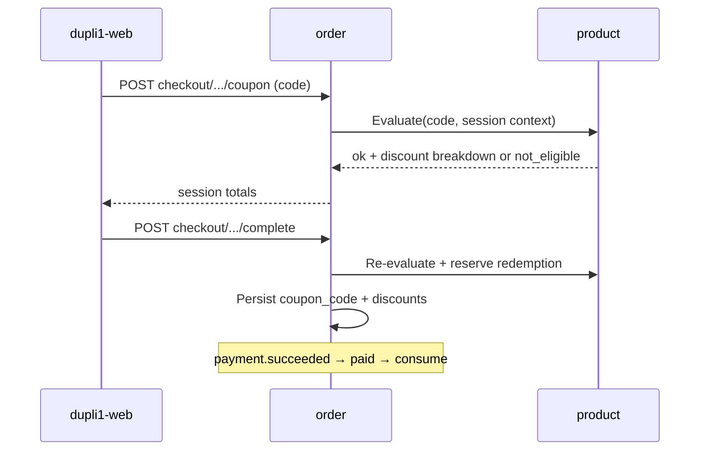

# Coupon / sales-trackable referral code plan

**Status:** Planning (2026-08-31; types + flexible conditions + policy decisions 2026-09-13) — not started. Target **v1.2+** commerce (after v1.0 / v1.1 platform slices).  
**Repos:** `dupli1` (product, order), `dupli1-web`, `dupli1-manage-web`.  
**Related:** [checkout-session.md](checkout-session.md), [api.md](api.md) (coupons + checkout), [payment-service.md](payment-service.md) (refund policy), [permissions.md](permissions.md), [product-multi-category-design.md](product-multi-category-design.md), [product-attributes.md](product-attributes.md), [product-guest-views-plan.md](product-guest-views-plan.md), [v1.1-release-plan.md](v1.1-release-plan.md) (commerce deferred to v1.2), [TODO.md](TODO.md).

## Goal

One promo system that can **discount**, **attribute sales**, or **both**, with:

1. **Two coupon types** by audience / use limit — **single-user one-time** and **global once-per-customer**.
2. **Flexible usage conditions** — eligibility and benefit can depend on **almost any checkout / catalog attribute** (prices, categories, shipping, brand/style/SKU, customer signals, etc.), not a fixed handful of columns.

Delivery (type code vs wallet) is a possession path, not a third type. All paths share discount math and order fields (`coupon_code` / `discount_won`, plus optional shipping discount fields when benefit targets delivery).

## Two coupon types (product taxonomy)

| | **Single-user one-time** | **Global (everyone once)** |
|--|--------------------------|----------------------------|
| Audience | Exactly one `customer_id` | Any authenticated customer (and later guests, if guest checkout exists) |
| Use limit | That user uses it **once** | **Each** user uses it **once** (`max_per_customer = 1`) |
| Typical identity | Shared template `code` + unique entitlement handle `customer_coupons.id` | One public `code` (e.g. `SUMMER30`) |
| How they usually get it | Manager/system **issues** to account (welcome, apology, VIP); optional unique claim token | Know the campaign code; optionally **claim** into “My coupons” then select |
| How they use it | Select from wallet / apply bound entitlement | Type code at cart/checkout (and/or select after claim) |
| Caps | One entitlement → one consumed redemption for that user | Per-customer cap = 1; optional global `max_redemptions` for campaign budget |
| Guest usable? | No — login required | Only after guest checkout ships **and** `allow_guest = true` (default false) |
| Storefront today | Profile Coupons UI stub only | Cart/checkout promo field → redeem + apply (no per-customer enforce) |

**Both types are in scope.** Same definition table + ledger; `scope` selects audience rules. **Conditions** (below) apply equally to both types.

| `scope` | Meaning | Implied defaults |
|---------|---------|------------------|
| `single_user` | One-time coupon for one account | Requires `customer_coupons` entitlement; `max_per_customer = 1` |
| `global` | Shared campaign; everyone may use once | `max_per_customer = 1`; apply by typing `code` (wallet claim optional) |

**Delivery (not a separate type):**

| Delivery | Fits |
|----------|------|
| Type `coupon_code` at checkout | **Global** (primary) |
| Account wallet (`customer_coupon_id`) | **Single-user** (primary); optional for global after claim |

## Usage conditions (flexible eligibility + benefit)

**Decision:** conditions are **first-class and flexible**. Managers can express rules over **checkout context + line/catalog attributes**, not only a hard-coded `min_subtotal`. Today’s “percent off goods subtotal, never shipping” behavior is the **default**, not the ceiling.

### Condition context (evaluated at apply + checkout complete)

Built from the checkout session / order draft:

| Area | Examples |
|------|----------|
| **Money** | Line `unit_price_won`, line extension, `subtotal_won`, `shipping_fee_won`, `total_won` before coupon, discount caps |
| **Catalog / taxonomy** | `category`, `subCategory`, `brandCode`, `styleCode`, `colorCode`, `sizeCode`, `edition`, merchandising fields, future category facets (`details.*`) |
| **Line identity** | `sku`, `skuId`, parent product id, quantity |
| **Shipping** | Flat fee amount; whether fee is present; free-shipping threshold style rules |
| **Customer** | `customer_id`, first-order / prior paid order count (when available), account age (later) |
| **Cart shape** | Item count, distinct brands/categories, only-eligible-lines subtotal |

“Almost all attributes” means: **any field order already has (or can load via product) for pricing lines** should be addressable in conditions as the catalog grows — prefer a **data-driven condition document** over adding one DB column per rule.

### Benefit targets (what the coupon changes)

| `benefit.target` | Effect |
|------------------|--------|
| `goods` | Discount eligible line goods only (today’s default; still capped so total ≥ shipping unless shipping is also targeted) |
| `shipping` | Reduce / zero `shipping_fee_won` (free or partial shipping) |
| `goods_and_shipping` | Apply configured discount across both per rule |
| `none` | Track-only / referral (`discount_won = 0`, no fee change) |

Eligible lines for `goods` are those matching **include** rules (category/brand/price band/…); non-matching lines stay full price. If no line matches, apply fails with a clear error (`not_eligible`).

### Condition document (sketch)

Store as JSONB on the coupon definition (versioned shape; validate on write in product service):

```text
conditions: {
  version: 1,
  all: [                 -- AND of predicates (empty = always eligible)
    { attr: "subtotal_won", op: "gte", value: 100000 },
    { attr: "shipping_fee_won", op: "gt", value: 0 },
    { attr: "line.category", op: "in", value: ["bags", "wallets"] },
    { attr: "line.brandCode", op: "in", value: ["PRADA"] },
    { attr: "line.unit_price_won", op: "gte", value: 500000 },
    { attr: "customer.paid_order_count", op: "eq", value: 0 }
  ],
  line_match: "any" | "all" | "eligible_only",  -- how line predicates combine with cart
  exclude: [             -- optional hard exclusions
    { attr: "line.skuId", op: "in", value: ["..."] }
  ]
}

benefit: {
  target: "goods" | "shipping" | "goods_and_shipping" | "none",
  discount_type: "percent" | "fixed" | "none",
  discount_fraction: 0.3,          -- when percent
  discount_fixed_won: 0,           -- when fixed (whole KRW)
  max_discount_won: null,          -- optional cap
  apply_to: "eligible_lines" | "entire_subtotal" | "shipping_fee"
}
```

**Evaluation ownership:** **order** builds the context from the session and asks **product** to validate the definition + compute the discount breakdown (or product exposes `Evaluate(coupon, context) → { ok, discount_won, shipping_discount_won, eligible_sku_ids, error }`). Re-run on checkout **complete** so cart edits cannot bypass rules.

**manage-web:** condition builder UI (predicates + benefit target), not only % / expires. Start with curated attribute pickers (money, category, brand, shipping, price); allow advanced JSON only if needed for power users.

**Storefront:** surface why a code failed (`min_spend`, `wrong_category`, `shipping_not_applicable`, `already_used`, `expired`). Optional: list wallet coupons with eligible / ineligible against current cart.

## Verdict

**Do not build a separate referral service.** Extend product coupon + order apply into a **promo** model with:

1. Hardened rules: real expiry, **once-per-customer** (global) and **single entitlement** (single-user), redemption ledger.
2. **Flexible conditions + benefit targets** (prices, categories, shipping, catalog attributes, …).
3. **Account wallet entitlements** for single-user coupons (and optional claim of global codes).
4. Optional **partner / campaign attribution** for sales reporting.
5. Optional **zero-discount** / hybrid referral codes.

## What already works

| Layer | Behavior |
|-------|----------|
| Product `coupons` | `code`, `discount` (fraction), `description`, `expires` (free-text), `active` — PG + memory; seed `SUMMER30` |
| Redeem | `POST /api/v1/products/coupons/redeem` — **lookup only**; no once-per-customer, no cart-aware eligibility |
| Order checkout | Apply → `%` of **full goods subtotal**; **shipping never discounted** ([api.md](api.md)) |
| Order row | Immutable `coupon_code` / `discount_won` / `total_won` |
| manage-web | CRUD code, %, description, expires, active — **no condition builder** |
| Storefront | Type code at cart/checkout; profile wallet stub |
| Permissions | `coupon.*` in catalog_editor bundle |

## Problem

1. **No usage accounting** — unlimited use; no once-per-customer.
2. **Expiry not enforced** — free-text `expires`.
3. **Conditions are not flexible** — only implicit “any cart, % of goods”; no category/brand/SKU/price-band/shipping/first-order rules; cannot discount shipping.
4. **Discount shape is narrow** — fraction only; no fixed ₩, max cap, or eligible-lines-only base.
5. **No sales reporting by code** / partner.
6. **Single-user path missing** — no issue + wallet.
7. **Referral** track-only / hybrid missing.

## Product question (coupon vs referral)

| Need | Coupon-only | Referral-only | **Unified promo (recommended)** |
|------|-------------|---------------|----------------------------------|
| % or ₩ off + flexible conditions | Yes | Optional | Yes (`conditions` + `benefit`) |
| Track who drove the order | Weak | Yes | Yes (`partner_id`) |
| Track-only | Awkward today | Yes | Yes (`benefit.target=none`) |
| Single-user vs global once | Missing | N/A | Yes (`scope`) |
| Manager CRUD | `/coupons` | New UI | Extend `/coupons` + condition builder |

**Recommendation:** one definition model. `scope` = audience. `conditions` / `benefit` = when and what. `kind` = discount vs referral campaign mode.

## Decisions

| Decision | Choice |
|----------|--------|
| Primary types | **`single_user`** and **`global`** (everyone once). No unlimited multi-use per customer in v1 |
| Usage conditions | **Flexible, first-class** — JSONB (or equivalent) predicates over checkout + catalog attributes; include **shipping, category, price**, brand/style/SKU, cart/customer signals as the catalog allows |
| Benefit targets | **`goods` / `shipping` / `goods_and_shipping` / `none`** — supersedes today’s goods-only assumption when configured |
| Condition evaluation | Server-side at apply **and** complete; client preview is advisory |
| Condition extensibility | Versioned document + allowlisted `attr` paths; add attrs as product/order expose them (align with multi-category facets later) |
| Ownership of definitions | **Product** — keep `/products/coupons` paths |
| Ownership of entitlements | **Product** — `customer_coupons`; profile UI only |
| Ownership of applied amounts | **Order** — `coupon_code`, `discount_won`; add `shipping_discount_won` (or fold into fee) when benefit hits shipping |
| Global once-per-customer | Ledger unique on `(code, customer_id)` |
| Single-user once | One entitlement → one consumed redemption |
| Redemption consume | **Reserve** on checkout complete, **consume** on `paid`, **release** on `canceled` (see § Policy decisions) |
| Currency | KRW only; whole won |
| Stacking | **One coupon per order**; coupon stacks on top of the catalog sale `price` |
| Discount base | Selling **`price`** only — never `officialPrice` |
| Refund / cancel | Cancel from `pending` / `paid` restores the use; `in_transit` cancel does not |
| Accounting | Discount is **contra-revenue** (revenue reduction), reported apart from GMV |
| Guests | Global codes only when guest checkout lands, and only with `allow_guest` on the definition; single-user always requires login |
| Naming | Customer cart/checkout keeps **프로모션 코드**, wallet keeps **쿠폰**; admin nav stays **쿠폰** |
| Expiry semantics | Stored UTC `timestamptz`; authored and displayed in **KST** (end-of-day) |
| Commission / payouts | Out of scope |
| Unlimited per-customer reuse | Out of scope for v1 |

## Policy decisions (decided 2026-09-13)

### 1. What a coupon applies to

| Case | Decision |
|------|----------|
| Default | **Goods only**, capped at eligible subtotal — matches today ([api.md](api.md): a 100%-off coupon still pays delivery) |
| Free / partial shipping | Supported via `benefit.target = shipping` or `goods_and_shipping`; expressed as fraction or fixed ₩ off `shipping_fee_won`, floored at 0 |
| Brand / SKU / category scope | `conditions` predicates on `line.category`, `line.subCategory`, `line.brandCode`, `line.styleCode`, `line.skuId`; percent applies to **eligible lines only** when `benefit.apply_to = eligible_lines` |
| First order only | `conditions.all[{ attr: "customer.paid_order_count", op: "eq", value: 0 }]` — counts **paid** orders, so unpaid/canceled attempts do not consume the privilege |
| New customers only | Same predicate as first-order for v1; account-age (`customer.created_within_days`) added when needed rather than a separate flag |
| Discount base | Line **selling price** (`price`), the same value order already resolves server-side. `officialPrice` is display-only and never a discount base |

### 2. Stacking and interaction with sale prices

- **One coupon per checkout session / order** stays a hard rule in v1 (single `coupon_code`).
- A coupon **stacks on the sale price**: catalog `price` is already the post-markdown selling price, so coupon percent applies after markdown. No “coupon vs markdown, pick the better” logic.
- Managers who do not want double discounting use a condition instead of new code: `line.on_sale = false` (derived: `officialPrice > price`) or `line.sale_discount_percent lte N`. This keeps the policy in data, not in the pricing path.
- Referral/track-only codes (`benefit.target = none`) never conflict, so they may coexist with future auto-promotions.

### 3. Refund / cancel after paid

Coupon use follows the order’s terminal state, using the existing refund policy in [payment-service.md](payment-service.md):

| Order path | Ledger | Entitlement |
|------------|--------|-------------|
| `pending` expiry / cancel (5 min TTL) | `reserved` → `released` | back to `available` |
| `paid` → `canceled` (immediate refund, or approved / 2-hour auto-approved cancel request) | `consumed` → `released` | back to `available` |
| `in_transit` → `canceled` (refund, no restock) | stays `consumed` | stays `used` |
| `fulfilled` | stays `consumed` | stays `used` |

Rationale: the coupon mirrors the stock rule — before shipment nothing was consumed for real, after shipment it was. Restores never extend `expires_at`: a released coupon whose window has passed becomes `expired`. A manager can always re-issue (single-user) as a goodwill action.

### 4. Abuse controls

| Risk | Decision |
|------|----------|
| Guessable single-user codes | Prefer **shared template code + `customer_coupon_id` (ULID)** as the apply handle, so there is no secret to guess. If a per-issue code is ever needed, ≥12 chars from a Crockford base32 alphabet |
| Brute-force redeem probing | Rate-limit validate/redeem per IP and per `customer_id`, reusing the existing Redis limiter pattern from auth (`auth/pkg/infra/redis/ratelimiter.go`). Fail-open is acceptable because **complete re-validates** authoritatively |
| Multi-account farming of global codes | Enforcement key is `customer_id` (email-unique accounts). Device/phone fingerprinting is **not** in scope; instead cap exposure with campaign `max_redemptions` and monitor unique-customer stats |
| Self-referral | **Blocked** — reject when `partner_id` resolves to the purchasing `customer_id` |
| Wallet theft / transfer | Entitlements are non-transferable; apply requires `customer_coupons.customer_id == sub` (ABAC) |
| Coupon enumeration via error messages | Reason codes distinguish `expired` / `already_used` / `not_eligible`, but an unknown code always returns the same `invalid_code` |

### 5. Lifecycle operations

- **Pause** = `active = false`. Takes effect immediately for new applies; already-`reserved`/`consumed` redemptions are untouched, and sessions holding it re-validate at complete (so a paused code fails there).
- **Edit** benefit / conditions is allowed and is **never retroactive**. Orders keep their immutable `coupon_code` / `discount_won`, and the ledger stores the **applied benefit snapshot** so reports stay truthful after an edit.
- **Delete** = deactivate (soft). Hard delete only when `redemption_count = 0` and no ledger rows; otherwise the definition is needed to explain historical orders.
- **Revoke** applies to one entitlement (`status = revoked`), for issued-by-mistake cases; revoking never rewrites a paid order.
- Every definition carries `updated_at` (and optional `version`) so the condition builder can warn “this code is live, N customers already used it”.

### 6. Auto-issue triggers

Manual manager issue is the Phase 2 baseline. Automated issuing is **Phase 4**, event-driven off existing NATS subjects rather than new schedulers:

| Trigger | Source | Coupon |
|---------|--------|--------|
| Welcome | `user.registered` (auth already publishes) | single-user welcome |
| Apology | `order.canceled` | single-user goodwill |
| VIP tier | paid GMV per customer (batch, later) | single-user tier reward |

Issuing must be **idempotent** on `(code, customer_id, trigger_key)` so a redelivered event cannot mint duplicates.

### 7. Checkout / storefront UX

- Wallet list shows **eligible vs ineligible against the current cart**, with the reason (e.g. “100,000원 이상 구매 시”), rather than hiding ineligible coupons.
- Typed codes keep the single promo input; the API returns machine-readable reason codes so copy stays in the frontends:

| Reason code | Meaning |
|-------------|---------|
| `invalid_code` | Unknown code (also used for revoked/deleted, to avoid enumeration) |
| `expired` | Past `expires_at` |
| `already_used` | This customer already consumed it (global) or entitlement is `used` |
| `not_eligible` | Conditions unmet; includes a sub-reason (`min_spend`, `category`, `brand`, `shipping_not_applicable`, `on_sale_excluded`) |
| `campaign_exhausted` | `max_redemptions` reached |
| `login_required` | Single-user / account-scoped coupon on a guest session |

- **No auto-apply of the “best” coupon** in v1: the customer chooses explicitly. The eligibility API makes a future “best coupon” hint additive.

### 8. Accounting and finance reporting

- Discount is treated as **contra-revenue** (a reduction of goods revenue), not a marketing expense. Net revenue = `subtotal_won - discount_won`; shipping is reported separately.
- **Goods discount and shipping discount are reported separately** (`discount_won` vs `shipping_discount_won`) so delivery subsidy is visible as its own line.
- Campaign reporting comes from the **product redemption ledger filtered to `consumed` (paid)**, cross-checkable against order rows by `coupon_code`. Released redemptions are excluded from GMV but retained for audit.
- manage-web analytics is client-side today (sums `total_won` from `GET /orders`); campaign stats need the server endpoint added in Phase 3 rather than more browser aggregation.

### 9. Guests

- **Single-user coupons always require login** (they are bound to a `customer_id`).
- **Global codes may be used by guests only after guest checkout ships** (v1.2 per [product-guest-views-plan.md](product-guest-views-plan.md) / [cart-service.md](cart-service.md)), and only when the definition sets `allow_guest = true`. Default is `false`.
- For guest orders, once-per-customer degrades to a best-effort key (order email) and is documented as weaker; campaigns that need hard limits should stay login-only.

### 10. i18n and legal copy

- Keep today’s split: cart/checkout say **프로모션 코드**, the account wallet says **쿠폰**, admin nav stays **쿠폰**. No rename to “Promo codes” — the code-vs-wallet wording already matches how customers encounter each surface.
- **Expiry is authored and shown in KST.** Store `expires_at` as UTC `timestamptz`; a manager picking a date means **end of that day, 23:59:59 Asia/Seoul**. Comparisons run in UTC, so no ambiguity at the boundary. (`notification` already formats KST for ops alerts.)
- Each definition gets an optional **`terms`** text shown on redeem, in the wallet, and in the checkout summary, so campaign conditions are stated to the customer instead of living only in the manager UI. Multi-language `terms` follows the existing i18n pattern when needed.

## Domain model (target)

### Promo definition (product)

| Field | Type | Notes |
|-------|------|-------|
| `code` | text PK | Uppercased; existing |
| `scope` | text | `single_user` \| `global` |
| `kind` | text | `discount` \| `referral` \| `hybrid` |
| `description` | text | Existing |
| `expires_at` | timestamptz nullable | Enforce |
| `active` | bool | Existing |
| `max_redemptions` | int nullable | Campaign-wide cap |
| `max_per_customer` | int | Default **1** |
| `conditions` | jsonb | Versioned predicates (see above); empty = always eligible |
| `benefit` | jsonb | `target`, `discount_type`, fraction/fixed/cap/`apply_to` |
| `discount` | float | **Legacy** percent column; migrate into `benefit` but keep readable for old clients until cutover |
| `expires` | text | Legacy display until clients use `expires_at` |
| `allow_guest` | bool | Default **false**; only meaningful for `global` once guest checkout exists |
| `terms` | text | Customer-facing conditions copy shown on redeem / wallet / checkout |
| `partner_id` / `partner_label` | text | Attribution |
| `redemption_count` | int | Denormalized |
| `updated_at` | timestamptz | Warn in admin UI when editing a live code |

Drop relying on a lone `min_subtotal_won` column long-term — express min spend as `conditions.all[{ attr: subtotal_won, op: gte, … }]`. A generated/cached `min_subtotal_won` for list UI is optional.

Validate + complete rules:

- active / expiry / scope caps (as before)
- **conditions match** current context (else `not_eligible` with reason code)
- compute `discount_won` / shipping adjustment from **benefit** against eligible base only
- re-check on complete after final line prices

### Account entitlement (product) — `single_user`

```text
customer_coupons (
  id, customer_id, code,
  status,            -- available | reserved | used | expired | revoked
  source,            -- issue | claim | system
  issued_by, expires_at, created_at, used_order_id
)
```

Claim/issue does **not** consume; paid (or reserved) checkout does.

### Redemption ledger (product)

```text
coupon_redemptions (
  id, code, order_id, customer_id,
  customer_coupon_id nullable,
  discount_won, shipping_discount_won,
  order_subtotal_won, eligible_subtotal_won,
  applied_benefit jsonb,          -- snapshot so later edits don't rewrite history
  status: reserved | consumed | released,
  created_at, paid_at nullable, released_at nullable
)
```

Lifecycle: `reserved` at checkout complete → `consumed` on `paid` → `released` on cancel from `pending`/`paid` (not from `in_transit`). Reports count `consumed` only.

### Order wire

Keep `coupon_code`, `discount_won`. Shipping benefits add an explicit **`shipping_discount_won`** (decided: do not silently mutate `shipping_fee_won`, so the subsidy stays reportable), making the total:

```text
total_won = subtotal_won - discount_won + shipping_fee_won - shipping_discount_won
```

with `shipping_discount_won ≤ shipping_fee_won`. Optional `customer_coupon_id`, `partner_id` snapshot.

## Attribution & reporting

- Stats by code / partner / scope from `consumed` ledger rows (paid only); break out goods vs shipping discount given.
- Discount reported as **contra-revenue**, so net goods revenue and delivery subsidy are both visible.
- manage-web: scope, condition builder, issue-to-customer, campaign stats.
- Storefront: one promo per order; eligibility errors carry reason codes.

## Flows (target)

### Global — with condition check



### Single-user — issue + wallet + conditions

Same evaluate step, but input is `customer_coupon_id`; entitlement must be `available` and owned by `sub`. Conditions still apply (e.g. category / min spend) even for issued coupons.

## Phases

### Phase 0 — Plan + contracts

- [x] This plan
- [x] Index in [README.md](README.md) / [TODO.md](TODO.md)
- [x] Types: single-user one-time + global everyone-once
- [x] Flexible usage conditions (shipping, category, price, extensible attrs)
- [x] Policy decisions: applicability, stacking, refund restore, abuse, lifecycle, auto-issue, UX, accounting, guests, i18n
- [ ] api.md stubs when implementation starts

### Phase 1 — Harden + global once-each + condition engine v1

1. `scope`, `expires_at` (KST end-of-day authoring), caps, `terms`, redemption ledger with `applied_benefit`; existing rows → `scope=global`.
2. **`conditions` + `benefit` JSONB** with allowlisted attrs for v1: `subtotal_won`, `shipping_fee_won`, `line.category`, `line.brandCode`, `line.unit_price_won`, `line.skuId` / parent id, `line.on_sale`; ops `eq|neq|in|nin|gte|lte|gt|lt`.
3. Benefit targets `goods` | `shipping` | `none` (add `goods_and_shipping` if cheap); `shipping_discount_won` on session/order.
4. Order apply/complete calls Evaluate; migrate legacy `discount` fraction into default `benefit`.
5. Reserve → consume → release wiring: consume on `payment.succeeded`, release on cancel from `pending`/`paid`, keep consumed on `in_transit` cancel.
6. Redeem/validate rate limit (per IP + per customer) reusing the auth Redis limiter pattern.
7. Tests: once-per-customer, expiry boundary in KST, category miss, min spend, free-shipping benefit, on-sale exclusion, cancel releases, in-transit cancel does not.
8. manage-web: condition form + live-code edit warning + pause/soft-delete; storefront: reason-coded errors.

### Phase 2 — Single-user wallet + issue

1. `customer_coupons` + manager issue / list APIs (ABAC `sub` == owner); checkout by `customer_coupon_id`.
2. Replace storefront profile stub; show eligible vs ineligible against the current cart with reasons; optional claim of global codes.
3. Entitlement `revoked` support for issued-by-mistake cases.
4. Tests: issue → eligible apply → paid → no reuse; cancel restores; cannot apply another customer's entitlement; ineligible category still blocked.

### Phase 3 — Richer attributes + referral attribution + finance reporting

1. Expand allowlist: `subCategory`, style/color/size, `details.*` facets as multi-category lands, `customer.paid_order_count` (first-order-only), account age.
2. `kind`, `partner_id`, self-referral block; stats API (paid-only ledger) splitting goods vs shipping discount; manage-web campaign report.
3. Eligible-lines-only percent/fixed + `max_discount_won` polish.

### Phase 4 — Optional later

1. Auto-issue triggers off NATS (`user.registered` welcome, `order.canceled` apology, VIP tier), idempotent per `(code, customer_id, trigger_key)`.
2. Advanced builder / saved condition templates; "best coupon" hint.
3. Guest usage of `allow_guest` global codes once guest checkout ships.
4. (Defer) multi-coupon stacking, multi-use per customer.

## Non-goals (this plan)

- Separate `dupli1-referral` service
- Multi-code stacking on one order
- Per-customer multi-use of the same global code
- Automatic partner commission / tax
- Guest-held single-user coupons
- Renaming wire fields away from `coupon_code` / `discount_won`
- Formal SQL migration tooling
- Wallet ledger in `profile`
- Arbitrary unvalidated script/code as conditions (allowlisted attrs + ops only)
- Device / phone fingerprinting against multi-account farming
- Auto-picking the best coupon for the customer (v1 is an explicit choice)
- Choosing between coupon and markdown ("better of the two" pricing)

## Resolved (2026-09-13)

| Question | Resolution |
|----------|------------|
| Consume on create vs paid | Reserve at complete, consume at `paid`, release on cancel |
| Shipping wire | Explicit `shipping_discount_won`, never a silent `shipping_fee_won` rewrite |
| Refund restores the use? | Yes for cancel from `pending`/`paid`; no for `in_transit` |
| Self-referral | Blocked |
| Sale + coupon | Coupon applies to selling `price`; optional `line.on_sale` exclusion condition |
| Single-user code string | Shared template code + `customer_coupon_id` handle |
| Admin nav rename | No — stays 쿠폰 / 프로모션 코드 per surface |
| Discount accounting | Contra-revenue, goods vs shipping reported separately |
| Guests | `allow_guest` global codes only after guest checkout; single-user login-only |

## Open questions

1. **Attr allowlist growth** — which Phase 3 attributes are worth the index cost once category facets land?
2. **Global claim into wallet** — required for v1 UX, or type-at-checkout only until the wallet ships?
3. **VIP tier definition** — what GMV / order-count threshold, and recomputed how often?
4. **Guest once-per-identity** — is order email good enough, or should `allow_guest` codes stay campaign-capped only?

## Exit criteria (Phases 1–3)

- [ ] Global: at most one paid use per customer per code
- [ ] Single-user: issue → one paid use; no transfer/reuse
- [ ] Conditions can gate on **price**, **category**, and **shipping** (and extend to more attrs without a new service)
- [ ] Benefit can discount **goods** and/or **shipping** (or none for track-only)
- [ ] Cancel from `pending`/`paid` restores the use; `in_transit` cancel does not
- [ ] Editing a live code never changes past orders or reports (`applied_benefit` snapshot)
- [ ] Ineligible carts get explicit reason codes; complete re-validates
- [ ] Manager condition UI + campaign stats splitting goods vs shipping discount
- [ ] Tests + [api.md](api.md) / [current-state.md](current-state.md) updated

## Suggested sequencing vs releases

```text
v1.0 / v1.1  — no dependency; do not block launch
v1.2+        — Phase 0–3 (harden + conditions → wallet → richer attrs/attribution)
later        — Phase 4
```
