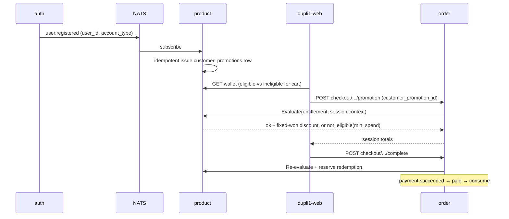
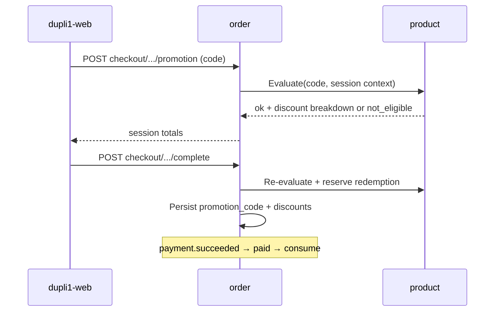

# Promotional code plan (discount + sales-trackable referral)

**Status:** **Phases 1–3 implemented (2026-09-16). The sign-up campaign is built and seeded inactive — enable `WELCOME50` in the admin to go live.** Supersedes the earlier "Planning / not started, target v1.2+" status.
Plan 2026-08-31; types + flexible conditions + policy decisions 2026-09-13; **terminology, sign-up campaign scope and resequencing 2026-09-16.**
**Repos:** `dupli1` (product, order, auth), `dupli1-web`, `dupli1-manage-web`.
**Related:** [product-promotion-rename.md](product-promotion-rename.md) (the `coupon` → `promotion` cutover), [checkout-session.md](checkout-session.md), [api.md](api.md), [payment-service.md](payment-service.md) (refund policy), [permissions.md](permissions.md), [product-multi-category-design.md](product-multi-category-design.md), [product-attributes.md](product-attributes.md), [product-guest-views-plan.md](product-guest-views-plan.md), [TODO.md](TODO.md).

## Why this is active now

v1.0 did not ship on its **2026-08-30** target ([v1.0-release-spec.md](v1.0-release-spec.md)). The earlier sequencing note ("v1.0 / v1.1 — no dependency; do not block launch; v1.2+ — Phase 0–3") assumed promotional codes could wait behind a launch that has since slipped.

That assumption is withdrawn. A **sign-up promotional code campaign** is now a marketing requirement, so the promotional code system is on the critical path rather than after it. The campaign requirement is specified in [§ Campaign: sign-up promotional code](#campaign-sign-up-promotional-code) and the phases below are ordered to deliver it.

## Terminology

**The product term is "promotional code."** Decided 2026-09-16; this **reverses** the earlier decision (old §10 / Resolved row) to keep a per-surface split of 쿠폰 / 프로모션 코드 and to treat wire renames as a non-goal.

The rename is **full** — customer copy, admin UI, docs, HTTP paths, JSON fields, Postgres columns, Go identifiers and the permission set all move from `coupon` to `promotion`. `discount_won` already reads neutrally and keeps its name.

| Surface | Before | After |
|---------|--------|-------|
| Customer copy (ko) | 쿠폰 / 프로모션 코드 (split by surface) | **프로모션 코드** everywhere |
| Admin nav | 쿠폰 / Coupons | **프로모션 코드 / Promotional codes** |
| Product HTTP | `/api/v1/products/coupons…` | `/api/v1/products/promotions…` |
| Order HTTP | `POST …/checkout/sessions/{id}/coupon` | `POST …/checkout/sessions/{id}/promotion` |
| JSON | `coupon_code` | `promotion_code` |
| Postgres | `coupons`, `orders.coupon_code`, `checkout_sessions.coupon_code` | `promotions`, `orders.promotion_code`, `checkout_sessions.promotion_code` |
| Permissions | `coupon.read|create|update|delete`, `coupon.*` | `promotion.read|create|update|delete`, `promotion.*` |
| Go | `domain.Coupon`, `CouponStore`, `CouponService`, `CouponClient`, `infra/httpcoupon` | `domain.Promotion`, `PromotionStore`, `PromotionService`, `PromotionClient`, `infra/httppromotion` |

Sequencing, alias policy, dual-read decoders and the per-repo checklist live in **[product-promotion-rename.md](product-promotion-rename.md)**. The rename lands **before** new fields are added (Phase 1), so nothing new is ever written under the old vocabulary.

Throughout this document "promotional code" means the definition a manager creates; "entitlement" means one account's right to use a `single_user` code; "redemption" means one ledger row against one order.

## Goal

One promotion system that can **discount**, **attribute sales**, or **both**, with:

1. **Two promotional code types** by audience / use limit — **single-user one-time** and **global once-per-customer**.
2. **Flexible usage conditions** — eligibility and benefit can depend on **almost any checkout / catalog attribute** (prices, categories, shipping, brand/style/SKU, customer signals), not a fixed handful of columns.

Delivery (typed code vs wallet) is a possession path, not a third type. All paths share discount math and order fields (`promotion_code` / `discount_won`, plus `shipping_discount_won` when the benefit targets delivery).

## Campaign: sign-up promotional code

The first production campaign, and the reason Phases 1–3 are sequenced as they are.

**Agreed parameters (2026-09-16):** code `WELCOME50`, named "First-purchase
discount", **50,000원 off**, **minimum spend 100,000원**, **30-day window per
entitlement**, **no campaign budget cap**, and **existing accounts are
backfilled**.

Two clarifications settled at the same time:

- **No first-order condition**, despite the name. The name is marketing copy;
  the backfill hands the code to accounts that have already bought, and gating
  on purchase history would have given every existing buyer a code that always
  failed at checkout.
- **Expiry is per entitlement, not per campaign.** An account backfilled today
  and one registering next month each get a full 30 days, so the offer is worth
  the same to everyone and the campaign can run open-endedly.

| Aspect | Decision (2026-09-16) |
|--------|------------------------|
| **Delivery** | **Auto-issued to the account on sign-up.** On `user.registered`, product mints a `single_user` entitlement for the new `customer_id`; it appears in the storefront wallet. Not a public code typed from ad creative |
| **Benefit** | **Fixed ₩ off** (`benefit.discount_type = fixed`, `discount_fixed_won`). Not a percentage — the campaign quotes a flat won amount |
| **Condition** | **Minimum spend** — `conditions.all[{ attr: "subtotal_won", op: "gte", value: N }]` |
| **Use limit** | One entitlement → one paid use, per the `single_user` rules below |
| **Expiry** | Real `expires_at`, authored KST end-of-day. Expiry **must** be enforced before launch — today's free-text `expires` is decorative |
| **Scope** | `scope = single_user`, `kind = discount`, `benefit.target = goods` |

**Consequences for sequencing.** This pulls three previously-separate tranches onto one critical path:

| Need | Was | Now |
|------|-----|-----|
| Expiry, ledger, once-per-use accounting | Phase 1 | **Phase 2** (unchanged position, still first functional work) |
| Fixed ₩ benefit + `max_discount_won` floor | Phase 3 polish | **Phase 2** — the campaign's benefit shape |
| Min-spend predicate | Phase 1 condition engine | **Phase 2** — the campaign's only required predicate |
| `customer_promotions` wallet + issue API | Phase 2 | **Phase 3** |
| Auto-issue off `user.registered` | Phase 4 | **Phase 3** — campaign go-live gate |

Percent-off, shipping benefits, category/brand predicates and referral attribution stay **after** the campaign ships (Phase 4). They are designed for below so the schema does not have to change again, but they are not built first.

**Auto-issue input already exists.** `auth` publishes `user.registered` today (`auth/pkg/service/service.go:454`, covered by `TestRegisterPublishesUserRegisteredEvent`) with `{event_type, user_id, email, account_type, occurred_at}`. It is declared as a **local subject string** in auth, not in `shared/pkg/events`. Phase 3 promotes it to the shared contract alongside `UserDeleted`, per the one-canonical-contract-per-pair rule in the repo guide, then subscribes product to it. Issuing must be **idempotent** on `(code, customer_id, trigger_key)` so a redelivered event cannot mint duplicates, and must only fire for `account_type` customers — never managers or service accounts.

## Two promotional code types (product taxonomy)

| | **Single-user one-time** | **Global (everyone once)** |
|--|--------------------------|----------------------------|
| Audience | Exactly one `customer_id` | Any authenticated customer (and later guests, if guest checkout exists) |
| Use limit | That user uses it **once** | **Each** user uses it **once** (`max_per_customer = 1`) |
| Typical identity | Shared template `code` + unique entitlement handle `customer_promotions.id` | One public `code` (e.g. `SUMMER30`) |
| How they usually get it | Manager/system **issues** to account (**sign-up welcome**, apology, VIP); optional unique claim token | Know the campaign code; optionally **claim** into "My promotional codes" then select |
| How they use it | Select from wallet / apply bound entitlement | Type code at cart/checkout (and/or select after claim) |
| Caps | One entitlement → one consumed redemption for that user | Per-customer cap = 1; optional global `max_redemptions` for campaign budget |
| Guest usable? | No — login required | Only after guest checkout ships **and** `allow_guest = true` (default false) |
| Storefront today | Profile UI **stub only** (`COUPONS: Coupon[] = []`, redeem writes React state that is lost on reload) | Cart/checkout promo field → redeem + apply (no per-customer enforcement) |

**Both types are in scope**, but the **sign-up campaign is `single_user`**, so that path ships first. Same definition table + ledger; `scope` selects audience rules. **Conditions** apply equally to both types.

| `scope` | Meaning | Implied defaults |
|---------|---------|------------------|
| `single_user` | One-time promotional code for one account | Requires `customer_promotions` entitlement; `max_per_customer = 1` |
| `global` | Shared campaign; everyone may use once | `max_per_customer = 1`; apply by typing `code` (wallet claim optional) |

**Delivery (not a separate type):**

| Delivery | Fits |
|----------|------|
| Type `promotion_code` at checkout | **Global** (primary) |
| Account wallet (`customer_promotion_id`) | **Single-user** (primary, incl. the sign-up campaign); optional for global after claim |

## Usage conditions (flexible eligibility + benefit)

**Decision:** conditions are **first-class and flexible**. Managers can express rules over **checkout context + line/catalog attributes**, not only a hard-coded `min_subtotal`. Today's "percent off goods subtotal, never shipping" behavior is the **default**, not the ceiling.

For the sign-up campaign only `subtotal_won gte` is required. The engine is built general so the predicate set can grow without another schema change.

### Condition context (evaluated at apply + checkout complete)

Built from the checkout session / order draft:

| Area | Examples |
|------|----------|
| **Money** | Line `unit_price_won`, line extension, `subtotal_won`, `shipping_fee_won`, `total_won` before discount, discount caps |
| **Catalog / taxonomy** | `category`, `subCategory`, `brandCode`, `styleCode`, `colorCode`, `sizeCode`, `edition`, merchandising fields, future category facets (`details.*`) |
| **Line identity** | `sku`, `skuId`, parent product id, quantity |
| **Shipping** | Flat fee amount; whether fee is present; free-shipping threshold style rules |
| **Customer** | `customer_id`, first-order / prior paid order count, account age (later) |
| **Cart shape** | Item count, distinct brands/categories, only-eligible-lines subtotal |

"Almost all attributes" means: **any field order already has (or can load via product) for pricing lines** should be addressable in conditions as the catalog grows — prefer a **data-driven condition document** over adding one DB column per rule.

### Benefit targets (what the promotional code changes)

| `benefit.target` | Effect | Phase |
|------------------|--------|-------|
| `goods` | Discount eligible line goods only (default; capped so total ≥ shipping unless shipping is also targeted) | **2** |
| `shipping` | Reduce / zero `shipping_fee_won` (free or partial shipping) | 4 |
| `goods_and_shipping` | Apply configured discount across both per rule | 4 |
| `none` | Track-only / referral (`discount_won = 0`, no fee change) | 4 |

Eligible lines for `goods` are those matching **include** rules (category/brand/price band/…); non-matching lines stay full price. If no line matches, apply fails with `not_eligible`.

### Condition document (sketch)

Store as JSONB on the promotion definition (versioned shape; validate on write in product service):

```text
conditions: {
  version: 1,
  all: [                 -- AND of predicates (empty = always eligible)
    { attr: "subtotal_won", op: "gte", value: 100000 },          -- Phase 2 (sign-up campaign)
    { attr: "shipping_fee_won", op: "gt", value: 0 },
    { attr: "line.category", op: "in", value: ["bags", "wallets"] },
    { attr: "line.brandCode", op: "in", value: ["PRADA"] },
    { attr: "line.unit_price_won", op: "gte", value: 500000 },
    { attr: "customer.paid_order_count", op: "eq", value: 0 }
  ],
  line_match: "any" | "all" | "eligible_only",  -- how line predicates combine with cart
  exclude: [             -- optional hard exclusions
    { attr: "line.skuId", op: "in", value: ["..."] }
  ]
}

benefit: {
  target: "goods" | "shipping" | "goods_and_shipping" | "none",
  discount_type: "percent" | "fixed" | "none",
  discount_fraction: 0.3,          -- when percent
  discount_fixed_won: 5000,        -- when fixed (whole KRW) — sign-up campaign shape
  max_discount_won: null,          -- optional cap
  apply_to: "eligible_lines" | "entire_subtotal" | "shipping_fee"
}
```

**Fixed ₩ floor (Phase 2, campaign-critical).** A fixed discount must be clamped to the eligible base: `discount_won = min(discount_fixed_won, eligible_subtotal_won)`. Combined with the existing order rule that discount never exceeds subtotal, a 5,000원 code on a 3,000원 cart discounts 3,000원, never more, and the total can never go negative or below the shipping fee.

**Evaluation ownership:** **order** builds the context from the session and asks **product** to validate the definition + compute the discount breakdown — `Evaluate(code|entitlement, context) → { ok, discount_won, shipping_discount_won, eligible_sku_ids, reason }`. Re-run on checkout **complete** so cart edits cannot bypass rules. This replaces today's `Redeem` lookup, which only answers "does this code exist and is it active".

**manage-web:** condition builder UI (predicates + benefit target), not only % / expires. Start with curated attribute pickers (money, category, brand, shipping, price); allow advanced JSON only if needed for power users.

**Storefront:** surface why a code failed (`min_spend`, `wrong_category`, `shipping_not_applicable`, `already_used`, `expired`). Wallet lists entitlements with eligible / ineligible against the current cart.

## Verdict

**Do not build a separate referral service.** Extend the product promotion definition + order apply into one model with:

1. Hardened rules: real expiry, **once-per-customer** (global) and **single entitlement** (single-user), redemption ledger.
2. **Flexible conditions + benefit targets** (prices, categories, shipping, catalog attributes, …).
3. **Account wallet entitlements** for single-user promotional codes (and optional claim of global codes).
4. Optional **partner / campaign attribution** for sales reporting.
5. Optional **zero-discount** / hybrid referral codes.

## What already works

Verified against the code on 2026-09-16. Builds and tests pass in `product/pkg/{handler,service}` and `order/pkg/{domain,service}`.

| Layer | Behavior |
|-------|----------|
| Product `coupons` table | `code`, `discount` (fraction), `description`, `expires` (free-text), `active` — PG + memory; seeds `SUMMER30` |
| Redeem | `POST /api/v1/products/coupons/redeem` — **lookup only**; public, unauthenticated, unthrottled; no once-per-customer, no cart-aware eligibility |
| Order apply | `POST …/checkout/sessions/{id}/coupon` → `ApplyCheckoutCoupon` recomputes session totals |
| Order complete | **Re-redeems and recomputes the discount server-side** against repriced lines — client numbers are ignored (`order/pkg/service/checkout.go:143`) |
| Order row | Immutable `coupon_code` / `discount_won` / `total_won`; discount capped at subtotal, so a 100%-off code still pays delivery |
| manage-web | Full CRUD page (code, %, description, expires, active) — **no condition builder** |
| Storefront | Typed code at cart + checkout, applied to the session before complete; profile wallet is a **stub** |
| Permissions | `coupon.read|create|update|delete` + `coupon.*` in the `catalog_editor` / `catalog_admin` bundles |
| Tests | 4 — `TestRedeemCoupon`, `TestApplyCouponWithoutClientReturnsUnavailable`, `TestCompleteCheckoutRecomputesCouponDiscountAfterRepricing`, `TestCheckoutSessionTotalsWithCoupon` |

## Problem

1. **No usage accounting** — unlimited use; no once-per-customer. `SUMMER30` can be applied by everyone, on every order, forever.
2. **Expiry not enforced** — `expires` is free text, stored and displayed but never compared. No code path reads it.
3. **`discount` is unvalidated server-side** — the create/update handler accepts any `float64`. A definition with `discount = 5.0` saves cleanly and then fails at order apply, where `ApplyCoupon` requires `0 < d < 1`. manage-web validates client-side only.
4. **Conditions are not flexible** — only implicit "any cart, % of goods"; no category/brand/SKU/price-band/shipping/first-order rules; cannot discount shipping.
5. **Discount shape is narrow** — fraction only; **no fixed ₩** (which the sign-up campaign needs), no max cap, no eligible-lines-only base.
6. **No way to remove an applied code** — `CheckoutSession.ClearCoupon` exists but has no caller and no route, so a customer cannot undo an apply.
7. **No sales reporting by code** / partner.
8. **Single-user path missing** — no issue + wallet, which is exactly what the sign-up campaign delivers.
9. **Referral** track-only / hybrid missing.

## Product question (promotional code vs referral)

| Need | Code-only | Referral-only | **Unified promotion (recommended)** |
|------|-----------|---------------|--------------------------------------|
| % or ₩ off + flexible conditions | Yes | Optional | Yes (`conditions` + `benefit`) |
| Track who drove the order | Weak | Yes | Yes (`partner_id`) |
| Track-only | Awkward today | Yes | Yes (`benefit.target=none`) |
| Single-user vs global once | Missing | N/A | Yes (`scope`) |
| Manager CRUD | `/coupons` | New UI | Extend `/products/promotions` + condition builder |

**Recommendation:** one definition model. `scope` = audience. `conditions` / `benefit` = when and what. `kind` = discount vs referral campaign mode.

## Decisions

| Decision | Choice |
|----------|--------|
| **Terminology** | **"Promotional code"** everywhere — customer copy, admin, docs, **wire and DB**. Full rename per [product-promotion-rename.md](product-promotion-rename.md) (decided 2026-09-16, reverses the earlier "no rename") |
| **First campaign** | **Sign-up promotional code**: `single_user`, auto-issued on `user.registered`, **fixed ₩ off**, **minimum spend** condition |
| Primary types | **`single_user`** and **`global`** (everyone once). No unlimited multi-use per customer in v1 |
| Usage conditions | **Flexible, first-class** — JSONB predicates over checkout + catalog attributes. **`subtotal_won` ships first**; shipping, category, brand/style/SKU and cart/customer signals follow |
| Benefit types | **`percent` and `fixed`** both in the first functional slice (campaign needs `fixed`); `max_discount_won` cap alongside |
| Benefit targets | **`goods`** first; **`shipping` / `goods_and_shipping` / `none`** in Phase 4 |
| Condition evaluation | Server-side at apply **and** complete; client preview is advisory |
| Condition extensibility | Versioned document + allowlisted `attr` paths; add attrs as product/order expose them |
| Ownership of definitions | **Product** — `/api/v1/products/promotions` |
| Ownership of entitlements | **Product** — `customer_promotions`; profile UI only |
| Ownership of applied amounts | **Order** — `promotion_code`, `discount_won`; add `shipping_discount_won` when benefit hits shipping |
| Global once-per-customer | Ledger unique on `(code, customer_id)` |
| Single-user once | One entitlement → one consumed redemption |
| Redemption consume | **Reserve** on checkout complete, **consume** on `paid`, **release** on `canceled` (see § Policy decisions) |
| Auto-issue | **In scope for the campaign** (Phase 3), event-driven off `user.registered`, idempotent on `(code, customer_id, trigger_key)` |
| Currency | KRW only; whole won |
| Stacking | **One promotional code per order**; it stacks on top of the catalog sale `price` |
| Discount base | Selling **`price`** only — never `officialPrice` |
| Refund / cancel | Cancel from `pending` / `paid` restores the use; `in_transit` cancel does not |
| Accounting | Discount is **contra-revenue** (revenue reduction), reported apart from GMV |
| Guests | Global codes only when guest checkout lands, and only with `allow_guest`; single-user (incl. sign-up) always requires login |
| Expiry semantics | Stored UTC `timestamptz`; authored and displayed in **KST** (end-of-day) |
| Commission / payouts | Out of scope |
| Unlimited per-customer reuse | Out of scope for v1 |

## Policy decisions (decided 2026-09-13, terminology refreshed 2026-09-16)

### 1. What a promotional code applies to

| Case | Decision |
|------|----------|
| Default | **Goods only**, capped at eligible subtotal — matches today ([api.md](api.md): a 100%-off code still pays delivery) |
| **Fixed ₩ off** | `benefit.discount_type = fixed`; clamped to the eligible base so it can never exceed it (campaign shape) |
| **Minimum spend** | `conditions.all[{ attr: "subtotal_won", op: "gte", value: N }]` — a predicate, not a bare column (campaign shape) |
| Free / partial shipping | `benefit.target = shipping` or `goods_and_shipping`; fraction or fixed ₩ off `shipping_fee_won`, floored at 0 |
| Brand / SKU / category scope | Predicates on `line.category`, `line.subCategory`, `line.brandCode`, `line.styleCode`, `line.skuId`; percent applies to **eligible lines only** when `benefit.apply_to = eligible_lines` |
| First order only | `conditions.all[{ attr: "customer.paid_order_count", op: "eq", value: 0 }]` — counts **paid** orders, so unpaid/canceled attempts do not consume the privilege |
| New customers only | The sign-up campaign gets this structurally (issued at registration), so the predicate is not required for it; still available for global new-customer codes |
| Discount base | Line **selling price** (`price`), the value order already resolves server-side. `officialPrice` is display-only and never a discount base |

### 2. Stacking and interaction with sale prices

- **One promotional code per checkout session / order** stays a hard rule in v1 (single `promotion_code`).
- A promotional code **stacks on the sale price**: catalog `price` is already the post-markdown selling price, so a percent applies after markdown. No "code vs markdown, pick the better" logic.
- Managers who do not want double discounting use a condition instead of new code: `line.on_sale = false` (derived: `officialPrice > price`) or `line.sale_discount_percent lte N`. Policy stays in data, not in the pricing path.
- Referral/track-only codes (`benefit.target = none`) never conflict, so they may coexist with future auto-promotions.

### 3. Refund / cancel after paid

Use follows the order's terminal state, using the existing refund policy in [payment-service.md](payment-service.md):

| Order path | Ledger | Entitlement |
|------------|--------|-------------|
| `pending` expiry / cancel (5 min TTL) | `reserved` → `released` | back to `available` |
| `paid` → `canceled` (immediate refund, or approved / 2-hour auto-approved cancel request) | `consumed` → `released` | back to `available` |
| `in_transit` → `canceled` (refund, no restock) | stays `consumed` | stays `used` |
| `fulfilled` | stays `consumed` | stays `used` |

Rationale: the promotional code mirrors the stock rule — before shipment nothing was consumed for real, after shipment it was. Restores never extend `expires_at`: a released code whose window has passed becomes `expired`. A manager can always re-issue (single-user) as a goodwill action.

### 4. Abuse controls

| Risk | Decision |
|------|----------|
| Guessable single-user codes | Prefer **shared template code + `customer_promotion_id` (ULID)** as the apply handle, so there is no secret to guess. If a per-issue code is ever needed, ≥12 chars from a Crockford base32 alphabet |
| Brute-force redeem probing | Rate-limit validate/redeem per IP and per `customer_id`, reusing the Redis limiter pattern from auth (`auth/pkg/infra/redis/ratelimiter.go`). Fail-open is acceptable because **complete re-validates** authoritatively. Today's endpoint has **no limit at all** |
| **Sign-up farming** | The campaign's exposure is one entitlement per registered account. Enforcement key is `customer_id` (email-unique accounts); cap campaign exposure with `max_redemptions` and monitor unique-customer stats. Device/phone fingerprinting is **not** in scope |
| Multi-account farming of global codes | Same `customer_id` key; campaign `max_redemptions` caps the budget |
| Self-referral | **Blocked** — reject when `partner_id` resolves to the purchasing `customer_id` |
| Wallet theft / transfer | Entitlements are non-transferable; apply requires `customer_promotions.customer_id == sub` (ABAC) |
| Enumeration via error messages | Reason codes distinguish `expired` / `already_used` / `not_eligible`, but an unknown code always returns the same `invalid_code` |

### 5. Lifecycle operations

- **Pause** = `active = false`. Immediate for new applies; already-`reserved`/`consumed` redemptions are untouched, and sessions holding it re-validate at complete (so a paused code fails there).
- **Edit** benefit / conditions is allowed and is **never retroactive**. Orders keep their immutable `promotion_code` / `discount_won`, and the ledger stores the **applied benefit snapshot** so reports stay truthful after an edit.
- **Delete** = deactivate (soft). Hard delete only when `redemption_count = 0` and no ledger rows; otherwise the definition is needed to explain historical orders.
- **Revoke** applies to one entitlement (`status = revoked`), for issued-by-mistake cases; revoking never rewrites a paid order.
- Every definition carries `updated_at` (and optional `version`) so the condition builder can warn "this code is live, N customers already used it".

### 6. Auto-issue triggers

**Promoted from "later" to campaign-critical.** The sign-up welcome is the first trigger and gates campaign go-live (Phase 3). Others remain optional follow-ons.

| Trigger | Source | Promotional code | Phase |
|---------|--------|------------------|-------|
| **Sign-up welcome** | **`user.registered`** (auth publishes today) | **single-user welcome, fixed ₩ off, min spend** | **3** |
| Apology | `order.canceled` | single-user goodwill | 5 |
| VIP tier | paid GMV per customer (batch) | single-user tier reward | 5 |

Issuing must be **idempotent** on `(code, customer_id, trigger_key)` so a redelivered event cannot mint duplicates, and must skip non-customer `account_type`s. `user.registered` moves into `shared/pkg/events` as part of Phase 3 so publisher and subscriber share one contract.

### 7. Checkout / storefront UX

- Wallet list shows **eligible vs ineligible against the current cart**, with the reason (e.g. "100,000원 이상 구매 시"), rather than hiding ineligible codes. This replaces the stub list.
- Typed codes keep the single promotional-code input; the API returns machine-readable reason codes so copy stays in the frontends:

| Reason code | Meaning |
|-------------|---------|
| `invalid_code` | Unknown code (also used for revoked/deleted, to avoid enumeration) |
| `expired` | Past `expires_at` |
| `already_used` | This customer already consumed it (global) or entitlement is `used` |
| `not_eligible` | Conditions unmet; includes a sub-reason (`min_spend`, `category`, `brand`, `shipping_not_applicable`, `on_sale_excluded`) |
| `campaign_exhausted` | `max_redemptions` reached |
| `login_required` | Single-user / account-scoped code on a guest session |

- **Remove-applied-code** gets a route in Phase 2, wiring the already-written `ClearPromotion` (today's orphaned `ClearCoupon`).
- **No auto-apply of the "best" code** in v1: the customer chooses explicitly. The eligibility API makes a future "best code" hint additive.

### 8. Accounting and finance reporting

- Discount is **contra-revenue** (a reduction of goods revenue), not a marketing expense. Net revenue = `subtotal_won - discount_won`; shipping is reported separately.
- **Goods discount and shipping discount are reported separately** (`discount_won` vs `shipping_discount_won`) so delivery subsidy is visible as its own line.
- Campaign reporting comes from the **product redemption ledger filtered to `consumed` (paid)**, cross-checkable against order rows by `promotion_code`. Released redemptions are excluded from GMV but retained for audit.
- manage-web analytics is client-side today (sums `total_won` from `GET /orders`); campaign stats need the server endpoint added in Phase 4 rather than more browser aggregation.

### 9. Guests

- **Single-user promotional codes always require login** (bound to a `customer_id`). The sign-up campaign is therefore login-only by construction.
- **Global codes may be used by guests only after guest checkout ships** ([product-guest-views-plan.md](product-guest-views-plan.md) / [cart-service.md](cart-service.md)), and only when the definition sets `allow_guest = true`. Default `false`.
- For guest orders, once-per-customer degrades to a best-effort key (order email) and is documented as weaker; campaigns needing hard limits stay login-only.

### 10. i18n and legal copy

- **One term on every surface: 프로모션 코드 / "promotional code."** Decided 2026-09-16, replacing the earlier per-surface 쿠폰 / 프로모션 코드 split. Cart, checkout, the account wallet and admin nav all use it, and i18n keys move `coupons.*` → `promotions.*` in both frontends ([product-promotion-rename.md](product-promotion-rename.md)).
- **Expiry is authored and shown in KST.** Store `expires_at` as UTC `timestamptz`; a manager picking a date means **end of that day, 23:59:59 Asia/Seoul**. Comparisons run in UTC, so no ambiguity at the boundary. (`notification` already formats KST for ops alerts.)
- Each definition gets an optional **`terms`** text shown on redeem, in the wallet, and in the checkout summary, so campaign conditions are stated to the customer instead of living only in the manager UI. Multi-language `terms` follows the existing i18n pattern when needed.
- The sign-up campaign's `terms` must state the minimum spend and the expiry date, since both are enforced.

## Domain model (target)

### Promotion definition (product) — table `promotions`

| Field | Type | Notes | Phase |
|-------|------|-------|-------|
| `code` | text PK | Uppercased; existing | — |
| `scope` | text | `single_user` \| `global` | 2 |
| `kind` | text | `discount` \| `referral` \| `hybrid` | 4 |
| `description` | text | Existing | — |
| `expires_at` | timestamptz nullable | **Enforced** (today's `expires` never is) | 2 |
| `active` | bool | Existing | — |
| `max_redemptions` | int nullable | Campaign-wide cap | 2 |
| `max_per_customer` | int | Default **1** | 2 |
| `conditions` | jsonb | Versioned predicates; empty = always eligible | 2 |
| `benefit` | jsonb | `target`, `discount_type`, fraction/**fixed**/cap/`apply_to` | 2 |
| `discount` | float | **Legacy** percent column; migrated into `benefit`, kept readable until cutover | 2 |
| `expires` | text | **Legacy** display until clients use `expires_at` | 2 |
| `allow_guest` | bool | Default **false**; only meaningful for `global` once guest checkout exists | 4 |
| `terms` | text | Customer-facing conditions copy | 2 |
| `partner_id` / `partner_label` | text | Attribution | 4 |
| `redemption_count` | int | Denormalized | 2 |
| `updated_at` | timestamptz | Warn in admin UI when editing a live code | 2 |

Do not add a lone `min_subtotal_won` column — express min spend as `conditions.all[{ attr: subtotal_won, op: gte, … }]`. A generated/cached `min_subtotal_won` for list UI is optional.

Validate + complete rules:

- active / expiry / scope caps
- **conditions match** current context (else `not_eligible` with reason code)
- compute `discount_won` / shipping adjustment from **benefit** against the eligible base only, clamped
- re-check on complete after final line prices
- **validate on write**: reject `discount_fraction` outside `(0,1)` and negative `discount_fixed_won` at create/update, instead of failing later at apply (problem 3 above)

### Account entitlement (product) — `single_user`

```text
customer_promotions (
  id, customer_id, code,
  status,            -- available | reserved | used | expired | revoked
  source,            -- issue | claim | system
  trigger_key,       -- idempotency for auto-issue, e.g. "user.registered:<user_id>"
  issued_by, expires_at, created_at, used_order_id
)
```

Unique on `(code, customer_id, trigger_key)` for auto-issued rows. Claim/issue does **not** consume; paid (or reserved) checkout does.

### Redemption ledger (product)

```text
promotion_redemptions (
  id, code, order_id, customer_id,
  customer_promotion_id nullable,
  discount_won, shipping_discount_won,
  order_subtotal_won, eligible_subtotal_won,
  applied_benefit jsonb,          -- snapshot so later edits don't rewrite history
  status: reserved | consumed | released,
  created_at, paid_at nullable, released_at nullable
)
```

Lifecycle: `reserved` at checkout complete → `consumed` on `paid` → `released` on cancel from `pending`/`paid` (not from `in_transit`). Reports count `consumed` only.

### Order wire

`promotion_code` (renamed from `coupon_code`) and `discount_won`. Shipping benefits add an explicit **`shipping_discount_won`** (decided: do not silently mutate `shipping_fee_won`, so the subsidy stays reportable), making the total:

```text
total_won = subtotal_won - discount_won + shipping_fee_won - shipping_discount_won
```

with `shipping_discount_won ≤ shipping_fee_won`. Optional `customer_promotion_id`, `partner_id` snapshot.

## Attribution & reporting

- Stats by code / partner / scope from `consumed` ledger rows (paid only); break out goods vs shipping discount given.
- Discount reported as **contra-revenue**, so net goods revenue and delivery subsidy are both visible.
- manage-web: scope, condition builder, issue-to-customer, campaign stats.
- Storefront: one promotional code per order; eligibility errors carry reason codes.

## Flows (target)

### Sign-up campaign — auto-issue + wallet apply



### Global — typed code with condition check



## Phases

Ordered so the **sign-up campaign goes live at the end of Phase 3**.

### Phase 0 — Plan + contracts

- [x] This plan
- [x] Index in [README.md](README.md) / [TODO.md](TODO.md)
- [x] Types: single-user one-time + global everyone-once
- [x] Flexible usage conditions (shipping, category, price, extensible attrs)
- [x] Policy decisions: applicability, stacking, refund restore, abuse, lifecycle, auto-issue, UX, accounting, guests, i18n
- [x] **Terminology decided: "promotional code", full wire + DB rename** (2026-09-16)
- [x] **Sign-up campaign scoped**: auto-issue on `user.registered`, fixed ₩ off, min spend (2026-09-16)
- [x] **api.md / permissions.md / current-state.md stubs for the target surface** (2026-09-16)

### Phase 1 — Rename `coupon` → `promotion` — **done (2026-09-16)**

No behavior change. Lands first so Phase 2 never adds fields under the old vocabulary. Full checklist: **[product-promotion-rename.md](product-promotion-rename.md)**.

1. Product: `domain.Promotion`, `PromotionStore` (PG + memory), `PromotionService`, handlers, routes.
2. Order: `ports.PromotionClient`, `infra/httppromotion`, `promotion_code` on session + order, `ApplyCheckoutPromotion`.
3. Postgres column renames via the existing `renameColumnIfNeeded` helper (precedent: `renameMoneyCentsColumns`, `order/pkg/infra/pg/repository.go:304`); table rename `coupons` → `promotions`.
4. Permissions `coupon.*` → `promotion.*` with legacy acceptance during rollout.
5. nginx locations, both frontends (routes, API helpers, i18n keys), docs.
6. Old paths/JSON keys stay accepted as aliases for one release, then drop with the other legacy prefixes ([TODO.md](TODO.md)).

### Phase 2 — Harden + accounting + condition/benefit engine v1 — **done (2026-09-16)**

The functional core. Everything the campaign needs except the wallet.

1. [x] `scope`, **`expires_at` enforced** (KST end-of-day authoring), caps, `terms`, `updated_at`; existing rows → `scope=global`.
2. [x] **Redemption ledger** `promotion_redemptions` with `applied_benefit` snapshot; reserve → consume → release wiring (consume on `payment.succeeded`, release on cancel from `pending`/`paid`, keep consumed on `in_transit` cancel).
3. [x] Once-per-customer for `global` (ledger unique on `(code, customer_id)`).
4. [x] **`conditions` + `benefit` JSONB.** Allowlisted attrs for v1: **`subtotal_won`** (campaign), `shipping_fee_won`, `item_count`, `line.category`, `line.brandCode`, `line.unit_price_won`, `line.skuId` / parent id, `line.on_sale`; ops `eq|neq|in|nin|gte|lte|gt|lt`. The catalog attributes are resolved by product itself — see § Where a line's catalog attributes come from. `customer.paid_order_count` is allowed but **not yet supplied** by checkout, so a predicate on it refuses every cart.
5. [x] **Benefit `percent` + `fixed`** against `target = goods`, with `max_discount_won` and the clamp-to-eligible-base floor. Migrate the legacy `discount` fraction into a default `benefit`.
6. [x] **Write-time validation** of `benefit` (reject fraction outside `(0,1)`, negative fixed won) so bad definitions cannot be saved.
7. [x] Order apply/complete call `Evaluate` instead of `Redeem`; add the **remove-applied-code route** wiring `ClearPromotion`.
8. [x] Redeem/validate rate limit (per IP + per customer) reusing the auth Redis limiter pattern.
9. [x] Tests: expiry boundary in KST, once-per-customer, **fixed ₩ clamped to a smaller cart**, **min spend just under / just over**, category miss, on-sale exclusion, cancel releases, in-transit cancel does not, remove-applied-code.
10. [x] manage-web: condition form + fixed-₩ benefit + live-code edit warning + pause/soft-delete; storefront: reason-coded errors.

### Phase 3 — Wallet + issue + sign-up auto-issue → **campaign go-live** — **done (2026-09-16)**

1. [x] `customer_promotions` + manager issue / list APIs (ABAC `sub` == owner); checkout by `customer_promotion_id`.
2. [x] **Promote `user.registered` into `shared/pkg/events`** (subject + payload struct), keeping auth's publish behavior; subscribe product.
3. [x] **Auto-issue subscriber**: on `user.registered` with a customer `account_type`, mint the welcome entitlement idempotently on `(code, customer_id, trigger_key)`.
4. [x] Replace the storefront profile stub with the real wallet; show eligible vs ineligible against the current cart with reasons.
5. [x] Entitlement `revoked` support for issued-by-mistake cases.
6. [x] Tests: register → one entitlement; **redelivered event mints nothing**; manager/service accounts get none; eligible apply → paid → no reuse; cancel restores; cannot apply another customer's entitlement; min-spend still blocks.
7. [x] Campaign dry run against the dev stack before the marketing date.

### Phase 4 — Richer attributes + shipping benefit + attribution + reporting

1. Expand allowlist: `subCategory`, style/color/size, `details.*` facets as multi-category lands, `customer.paid_order_count` (first-order-only), account age.
2. Benefit targets `shipping` / `goods_and_shipping` / `none`; `shipping_discount_won` on session + order and in the total formula.
3. `kind`, `partner_id`, self-referral block; stats API (paid-only ledger) splitting goods vs shipping discount; manage-web campaign report.
4. Eligible-lines-only percent/fixed + `max_discount_won` polish; optional claim of global codes into the wallet.

### Phase 5 — Optional later

1. More auto-issue triggers off NATS (`order.canceled` apology, VIP tier).
2. Advanced builder / saved condition templates; "best code" hint.
3. Guest usage of `allow_guest` global codes once guest checkout ships.
4. (Defer) multi-code stacking, multi-use per customer.

## What Phase 2 shipped differently from this plan

- **Order calls `Evaluate`, then `Reserve` after the order exists.** The plan
  had one call; the order id is needed to key a reservation, and minting an id
  up front would have left a reservation behind whenever order creation failed.
  Reserving after means a refusal rolls the order back instead.
- **`Reserve` does not re-check the per-customer limit in the service.** The
  ledger holds the limit and the order's own row in one transaction, so it can
  tell "already used" from "retry of this order"; a check above it cannot, and
  counting the order's own reservation against it made a retried complete look
  like a second use. A test caught this.
- **Rate limiting has a per-process fallback.** Product had no Redis dependency
  and compose has no Redis service, so an unset `REDIS_URL` uses an in-process
  window. That is per-task, so the effective budget is multiplied by the task
  count until Redis is configured in ECS.
- **The storefront previews through the public `evaluate` endpoint.** It cannot
  compute a fixed-won or capped discount itself, and showing a client-side
  fraction would have displayed the wrong number for exactly the campaign's
  benefit shape.
- **Catalog attributes are resolved by product, not sent by the caller.** See
  the section below; the first cut shipped the predicates without anything to
  evaluate them against.
- **`benefit.target` other than `goods` is rejected on write.** Named in the
  schema so Phase 4 is additive, but refused now rather than saving a
  definition that silently discounts nothing.

## Where a line's catalog attributes come from

Decided while finishing Phase 2 (2026-09-21).

A condition can gate on a line's `category`, `brandCode`, parent id or sale
state, and **none of those travel with a checkout**. Order builds its
evaluation lines from priced order items, which carry identity, quantity and
price and nothing else. As first shipped, every such predicate read an empty
value and matched nothing, so a code carrying one was refused on every cart —
the admin could author a brand rule that could never be satisfied.

**The evaluator resolves them itself**, from the catalog product already owns:

```text
line {sku_id, sku} → variant → parent → {category, brandCode, productId, on_sale}
```

with `on_sale` derived as the parent's `officialPrice` standing above its
`price` (price lives on the parent, so a markdown is a parent-level fact).

Why here rather than in checkout:

- **One source of truth.** Order, the storefront preview and any future caller
  get identical verdicts, because none of them supply the values.
- **A discount must not depend on what the caller claims.** Values are taken
  from the catalog even when a caller sends them, the same rule that makes
  order resolve prices server-side. A client cannot claim a brand to earn a
  code.
- **No catalog columns in checkout.** Order would otherwise have to carry
  category and brand through `VariantInfo`, `OrderItem` and its schema for no
  other purpose.

Cost is bounded: the lookup runs only when a definition's conditions actually
reference a catalog attribute (`Conditions.NeedsCatalog`), batched by sku id
with a per-SKU fallback, and one parent read per distinct product. A lookup
that fails leaves the lines unenriched, so the predicates fail and the code is
refused — a catalog outage must not hand out discounts.

**Still not supplied:** `customer.paid_order_count`. Only order knows it, and
it sends none, so a first-order-only rule is refused rather than guessed at.
Wiring it means counting a customer's paid orders in order and putting the
number in the evaluation context.

## Non-goals (this plan)

- Separate `dupli1-referral` service
- Multi-code stacking on one order
- Per-customer multi-use of the same promotional code
- Automatic partner commission / tax
- Guest-held single-user promotional codes
- Formal SQL migration tooling (the existing inline `renameColumnIfNeeded` helper covers the rename)
- Wallet ledger in `profile`
- Arbitrary unvalidated script/code as conditions (allowlisted attrs + ops only)
- Device / phone fingerprinting against multi-account farming
- Auto-picking the best promotional code for the customer (v1 is an explicit choice)
- Choosing between promotional code and markdown ("better of the two" pricing)

> Removed 2026-09-16: *"Renaming wire fields away from `coupon_code` / `discount_won`"* — the rename is now Phase 1. `discount_won` still keeps its name.

## Resolved

| Question | Resolution | Decided |
|----------|------------|---------|
| Consume on create vs paid | Reserve at complete, consume at `paid`, release on cancel | 2026-09-13 |
| Shipping wire | Explicit `shipping_discount_won`, never a silent `shipping_fee_won` rewrite | 2026-09-13 |
| Refund restores the use? | Yes for cancel from `pending`/`paid`; no for `in_transit` | 2026-09-13 |
| Self-referral | Blocked | 2026-09-13 |
| Sale + code | Applies to selling `price`; optional `line.on_sale` exclusion condition | 2026-09-13 |
| Single-user code string | Shared template code + `customer_promotion_id` handle | 2026-09-13 |
| Discount accounting | Contra-revenue, goods vs shipping reported separately | 2026-09-13 |
| Guests | `allow_guest` global codes only after guest checkout; single-user login-only | 2026-09-13 |
| **Naming** | **"Promotional code" on every surface; full rename incl. wire + DB** — supersedes the 2026-09-13 "No — stays 쿠폰 / 프로모션 코드 per surface" | **2026-09-16** |
| **Release sequencing** | **Not deferred behind v1.0/v1.1.** v1.0 missed 2026-08-30; the campaign puts Phases 1–3 on the critical path | **2026-09-16** |
| **Sign-up delivery** | **Auto-issued single-user entitlement on `user.registered`**, surfaced in the wallet — not a public typed code | **2026-09-16** |
| **Sign-up benefit** | **Fixed ₩ off** with a **minimum spend** condition | **2026-09-16** |

## Open questions

1. **Campaign parameters** — the actual won amount, minimum spend threshold, expiry window and `max_redemptions` budget for the sign-up code. Marketing input; needed before Phase 3 dry run, not before Phase 1.
2. **Backfill for existing customers** — does the welcome code go only to accounts registered after go-live, or is there a one-off issue to the existing base? Affects whether a bulk-issue admin action is needed in Phase 3.
3. **Attr allowlist growth** — which Phase 4 attributes are worth the index cost once category facets land?
4. **Global claim into wallet** — required, or type-at-checkout only until more campaigns need it?
5. **VIP tier definition** — what GMV / order-count threshold, and recomputed how often?
6. **Guest once-per-identity** — is order email good enough, or should `allow_guest` codes stay campaign-capped only?

## Exit criteria

### Campaign go-live (Phases 1–3)

- [ ] Every surface says "promotional code"; no `coupon` identifier left outside the compatibility aliases
- [ ] Registering an account issues exactly one welcome entitlement; a redelivered `user.registered` issues none
- [ ] Fixed ₩ benefit never exceeds the eligible subtotal, and the order total never drops below the shipping fee
- [ ] Minimum spend is enforced at apply **and** re-checked at complete
- [ ] `expires_at` is enforced in KST end-of-day terms; an expired code cannot be applied
- [ ] Single-user: issue → one paid use; no transfer/reuse; another customer's entitlement is rejected
- [ ] Cancel from `pending`/`paid` restores the use; `in_transit` cancel does not
- [ ] Ineligible carts get explicit reason codes; a customer can remove an applied code
- [ ] Tests + [api.md](api.md) / [permissions.md](permissions.md) / [current-state.md](current-state.md) updated

### Full system (Phase 4)

- [ ] Global: at most one paid use per customer per code
- [ ] Conditions can gate on **price**, **category**, and **shipping** (and extend to more attrs without a new service)
- [ ] Benefit can discount **goods** and/or **shipping** (or none for track-only)
- [ ] Editing a live code never changes past orders or reports (`applied_benefit` snapshot)
- [ ] Manager condition UI + campaign stats splitting goods vs shipping discount

## Suggested sequencing

```text
now          — Phase 1 (rename) → Phase 2 (harden + conditions/benefit) → Phase 3 (wallet + auto-issue)
                 ↑ campaign go-live at the end of Phase 3
after        — Phase 4 (richer attrs, shipping benefit, attribution, reporting)
later        — Phase 5
```

Phases 1–3 do not depend on the v1.0 closeout items in [v1.0-release-spec.md](v1.0-release-spec.md) and can proceed alongside them; the campaign date, not the tag, is the constraint.
