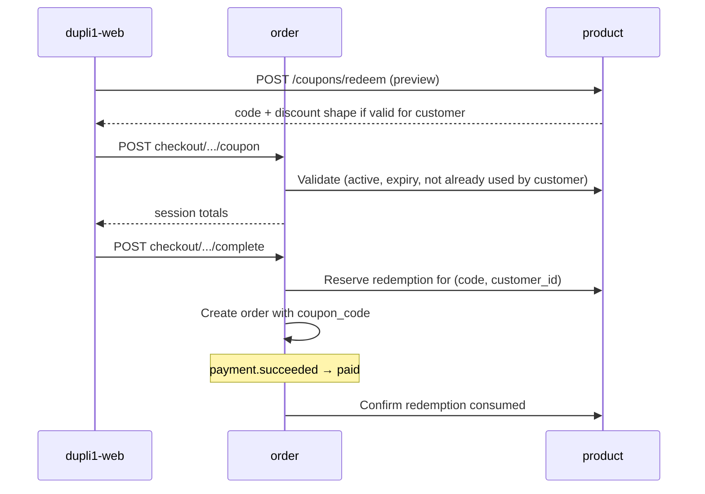
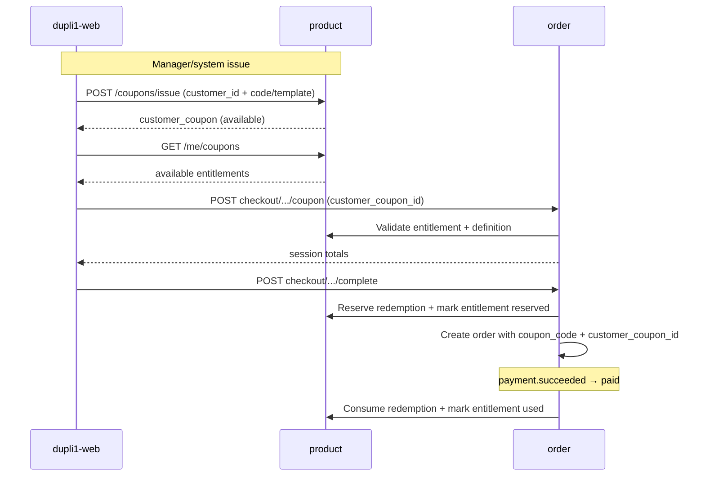

# Coupon / sales-trackable referral code plan

**Status:** Planning (2026-08-31; types clarified 2026-09-13) — not started. Target **v1.2+** commerce (after v1.0 / v1.1 platform slices).  
**Repos:** `dupli1` (product, order), `dupli1-web`, `dupli1-manage-web`.  
**Related:** [checkout-session.md](checkout-session.md), [api.md](api.md) (coupons + checkout), [payment-service.md](payment-service.md), [permissions.md](permissions.md), [v1.1-release-plan.md](v1.1-release-plan.md) (commerce deferred to v1.2), [TODO.md](TODO.md).

## Goal

One promo system that can **discount**, **attribute sales**, or **both**, with **two first-class coupon types** by audience and use limit:

1. **Single-user one-time** — issued (or uniquely bound) to **one** customer; that customer may use it **once**.
2. **Global, once per customer** — one shared definition/code that **everyone** may use, but **each customer only once**.

Delivery can be typing a code at checkout and/or holding an account wallet row; that is a possession path, not a third coupon type. Marketing coupons, partner/influencer referral codes, and personal issued coupons share the same discount math and order fields (`coupon_code` / `discount_krw`).

## Two coupon types (product taxonomy)

| | **Single-user one-time** | **Global (everyone once)** |
|--|--------------------------|----------------------------|
| Audience | Exactly one `customer_id` | Any authenticated customer (and later guests, if guest checkout exists) |
| Use limit | That user uses it **once** | **Each** user uses it **once** (`max_per_customer = 1`) |
| Typical identity | Unique entitlement (`customer_coupons.id`); template `code` may be shared or per-issue | One public `code` (e.g. `SUMMER30`) |
| How they usually get it | Manager/system **issues** to account (welcome, apology, VIP); optional unique claim token | Know the campaign code; optionally **claim** into “My coupons” then select |
| How they use it | Select from wallet / apply bound entitlement | Type code at cart/checkout (and/or select after claim) |
| Caps | One entitlement → one consumed redemption for that user | Per-customer cap = 1; optional global `max_redemptions` for campaign budget |
| Guest usable? | No | Yes when guest checkout exists (still once per customer identity) |
| Storefront today | Profile Coupons UI stub only | Cart/checkout promo field → redeem + apply (no per-customer enforce) |

**Both types are in scope.** Same definition table + ledger; `scope` selects the rules.

| `scope` | Meaning | Implied defaults |
|---------|---------|------------------|
| `single_user` | One-time coupon for one account | Requires `customer_coupons` entitlement; `max_per_customer = 1`; no public multi-user redeem of the same entitlement |
| `global` | Shared campaign; everyone may use once | `max_per_customer = 1`; apply by typing `code` (wallet claim optional) |

**Delivery (not a separate type):** how the customer presents the coupon at checkout.

| Delivery | Fits |
|----------|------|
| Type `coupon_code` at checkout | **Global** (primary). Not for consuming another user’s single-user entitlement. |
| Account wallet (`customer_coupon_id`) | **Single-user** (primary). Also optional for global after claim. |

## Verdict

**Do not build a separate referral service.** Extend the existing product coupon + order `coupon_code` / `discount_krw` path into a **promo** model with:

1. Hardened rules: real expiry, **once-per-customer** (global) and **single entitlement** (single-user), redemption ledger.
2. **Account wallet entitlements** for single-user coupons (and optional claim of global codes), replacing the storefront profile stub.
3. Optional **partner / campaign attribution** for sales reporting (GMV + order count by code).
4. Optional **zero-discount** codes (track-only referral) and **discount + track** hybrid codes.

Customer-facing UX keeps calling them “promo / coupon”; admin distinguishes single-user vs global, and discount vs referral campaigns.

## What already works

| Layer | Behavior |
|-------|----------|
| Product `coupons` | `code`, `discount` (fraction), `description`, `expires` (free-text), `active` — PG + memory; seed `SUMMER30` |
| Redeem | `POST /api/v1/products/coupons/redeem` (and legacy `/api/v1/coupons/redeem`) — **lookup only**; does not consume uses, enforce once-per-customer, or register to an account |
| Order checkout | `POST …/checkout/sessions/{id}/coupon` → product redeem → `coupon_code` + `%` of subtotal as `discount_krw` |
| Order row | Immutable `coupon_code` / `discount_krw` / `total_krw` on create; pricing server-side |
| manage-web | `/coupons` CRUD (code, %, description, expires, active toggle) |
| Storefront (global path) | Cart/checkout promo field; validates via redeem; applies via `applySessionCoupon` before complete |
| Storefront (single-user path) | Profile Coupons section: enter code → local list only; **not persisted**, lost on refresh |
| Permissions | `coupon.read|create|update|delete` / `coupon.*` (catalog_editor bundle) |

## Problem

Today’s coupons are **catalog labels with a percentage**, not a commerce instrument:

1. **No usage accounting** — redeem never increments a counter; unlimited global use; **no once-per-customer**.
2. **Expiry not enforced** — `expires` is display text (`"Aug 31, 2026"`); `GetActive` only checks `active`.
3. **Discount shape is narrow** — fraction only (`0 < f < 1`); no fixed KRW off, min spend, max discount, or SKU/brand scope.
4. **No sales reporting by code** — orders store `coupon_code`, but there is no aggregate API or admin report (orders × GMV × paid status).
5. **No partner / referrer identity** — cannot answer “how much did code `YUNA10` drive?” beyond grepping orders.
6. **Single-user coupons missing** — no issue-to-customer, no wallet entitlement, no one-time bind to one account.
7. **Referral is missing** — zero-discount attribution codes and partner payouts are out of scope of the current model.

Building a standalone “referral” microservice would duplicate the checkout apply path and leave coupon gaps unfixed. Splitting single-user vs global into two engines would duplicate discount rules.

## Product question (coupon vs referral)

| Need | Coupon-only | Referral-only | **Unified promo (recommended)** |
|------|-------------|---------------|----------------------------------|
| % or ₩ off at checkout | Yes | Optional | Yes (`discount_*`) |
| Track who drove the order | Weak (code string only) | Yes | Yes (`partner_id` / campaign) |
| Track-only (no discount) | Awkward (`discount=0` rejected today) | Yes | Yes (`kind=referral` or `discount=0` allowed) |
| Manager CRUD in one place | Already `/coupons` | New UI | Extend `/coupons` + reports |
| Checkout / payment path | Already wired | New wire | Reuse existing apply + order fields |
| Single-user vs global once | Missing | N/A | Yes (`scope` + wallet / per-customer cap) |

**Recommendation:** unified promo definitions. “Referral” is a **kind / campaign mode**. Audience/use is **`scope`** (`single_user` \| `global`). Delivery is code entry vs wallet select.

## Decisions

| Decision | Choice |
|----------|--------|
| Primary types | **`single_user`** (one customer, one use) and **`global`** (everyone, each once). Not unlimited multi-use per customer in v1 of this plan |
| Ownership of definitions | **Product** (existing `coupons` table / CRUD) — conceptually *promo codes*; keep HTTP paths `/products/coupons` for compatibility |
| Ownership of single-user entitlements | **Product** — `customer_coupons` next to definitions + redemption ledger. Profile UI is presentation only |
| Ownership of applied discount on purchase | **Order** — keep `coupon_code` + `discount_krw`; optional `customer_coupon_id` when applied from wallet |
| Global once-per-customer | Enforce via redemption ledger keyed by `(code, customer_id)`; `max_per_customer` default **1** for `scope=global` |
| Single-user once | One `customer_coupons` row → at most one consumed redemption; status `used` after paid (or reserved→used) |
| How single-user coupons are created | Manager/system **issues** to `customer_id` (primary); unique claim token optional later |
| How global coupons are obtained | Public **code** at checkout; optional claim into wallet for “My coupons” UX |
| Sales attribution moment | Count toward **paid** GMV when order becomes `paid` (payment.succeeded). Pending/canceled do not count |
| Redemption / usage consume | On **checkout complete** (order create), after server re-validates — not on preview redeem, not on claim-to-wallet, not on cart |
| Track-only codes | Allowed: `discount_fraction = 0` and/or `discount_krw = 0`; session still stores `coupon_code` |
| Partner entity | Lightweight: optional `partner_id` + display name on the definition. No payout ledger in v1 of this plan |
| Currency | KRW only; fixed discounts are whole won (`*_krw` = whole KRW) |
| Permissions | Reuse `coupon.*` for definitions; wallet uses ABAC (`sub` == owner). Manager issue may need `coupon.issue` (or reuse `coupon.update`) |
| Commission / influencer payout | **Out of scope** — report GMV by code/partner; finance settles offline |
| Unlimited per-customer reuse | **Out of scope** for v1 — both types are one-time for a given customer |

## Domain model (target)

### Promo definition (product)

Extend `coupons` (additive columns; keep `code` PK):

| Field | Type | Notes |
|-------|------|-------|
| `code` | text PK | Uppercased; existing. Global campaign code, or template code for single-user issues |
| `scope` | text | `single_user` \| `global` (required for new rows; migrate existing → `global`) |
| `kind` | text | `discount` \| `referral` \| `hybrid` (default `discount`) |
| `discount_type` | text | `percent` \| `fixed` \| `none` |
| `discount` / `discount_fraction` | float | Keep existing column for percent; `0` allowed when type `none` |
| `discount_fixed_krw` | bigint | Whole KRW off when type `fixed` |
| `description` | text | Existing |
| `expires_at` | timestamptz nullable | Enforce on redeem / claim / apply; migrate away from free-text `expires` |
| `active` | bool | Existing |
| `max_redemptions` | int nullable | Campaign-wide cap (mostly global); null = unlimited customers (each still once) |
| `max_per_customer` | int | For `global` default **1**; for `single_user` always **1** |
| `min_subtotal_krw` | bigint | Default 0 |
| `partner_id` | text nullable | Referrer / campaign owner |
| `partner_label` | text | Admin display |
| `redemption_count` | int | Denormalized counter (ledger is source of truth) |

Rules on validate and again on checkout complete:

- `active` and (`expires_at` is null or `now < expires_at`)
- **Global:** this `customer_id` has no prior consumed (or reserved) redemption for `code`
- **Single-user:** entitlement exists, `status=available`, `customer_id` matches session user, not already used
- optional campaign `max_redemptions` not exceeded
- subtotal ≥ `min_subtotal_krw` (at apply / complete)
- discount math: percent → `floor(subtotal * fraction)` or existing int cast; fixed → `min(fixed, subtotal)`; none → `0`

### Account entitlement (product) — required for `single_user`

```text
customer_coupons (
  id,                -- ULID (apply handle)
  customer_id,       -- auth user id (exactly one owner)
  code,              -- FK to coupons.code (template / campaign label)
  status,            -- available | reserved | used | expired | revoked
  source,            -- issue | claim | system
  issued_by,         -- manager user id when source=issue; nullable
  expires_at,        -- snapshot or override; null = inherit definition
  created_at,
  used_order_id      -- set when consumed
)
```

| Event | Entitlement |
|-------|-------------|
| Manager/system issues (`scope=single_user`) | Insert `available` for that `customer_id` |
| Customer claims global code into wallet (optional UX) | Insert `available` if not already held / used for that code |
| Checkout applies from wallet | Session stores `customer_coupon_id` + `coupon_code` |
| Order → `paid` | `used` + `used_order_id` |
| Order → `canceled` from pending | Back to `available` |
| Past `expires_at` | `expired` (lazy or job) |

Issuing/claiming **does not** burn the once-per-customer use; **paid checkout** does (same ledger).

### Redemption ledger (product)

Prefer **order as source of applied code** + a **product redemption ledger**:

```text
coupon_redemptions (
  id, code, order_id, customer_id,
  customer_coupon_id nullable,   -- set for single-user (and wallet-applied global)
  discount_krw, order_subtotal_krw,
  status: reserved | consumed | released,
  created_at, paid_at nullable
)
```

Unique constraint (consumed/reserved): **one live redemption per (`code`, `customer_id`)** for global once-each; for single-user also unique on `customer_coupon_id`.

| Event | Ledger |
|-------|--------|
| Checkout complete | Insert `reserved`; bump counters if counting at create |
| Order → `paid` | Mark `consumed` / set `paid_at`; sales report uses this |
| Order → `canceled` from pending | `released`; free the once-slot; restore entitlement if any |

Exact reserve-vs-paid timing is an open question below; **reports always filter paid**.

### Order (unchanged wire + optional enrichment)

Keep `coupon_code`, `discount_krw`. Add optional `customer_coupon_id` when applied from wallet / single-user. Optional later: `partner_id` snapshot on the order row.

## Attribution & reporting

**Sales by code (manager):**

- Inputs: `code` or `partner_id`, date range, status filter (default `paid`+), optional `scope` filter
- Metrics: order count, GMV (`sum(total_krw)`), discount given (`sum(discount_krw)`), AOV, unique customers
- API sketch: `GET /api/v1/products/coupons/{code}/stats` and/or `GET /api/v1/products/coupons/stats?partner_id=`
- manage-web: scope on create; issue-to-customer for `single_user`; stats drawer; orders already show `coupon_code`

**Storefront:** one promo per order. Global: type code (reject if this customer already used). Single-user: select from wallet. Track-only still allowed (`discount_krw = 0`).

## Flows (target)

### Global — everyone once (code at checkout)



### Single-user — one account, one use



## Phases

### Phase 0 — Plan + contracts (this doc)

- [x] This plan
- [x] Index in [README.md](README.md) / checklist in [TODO.md](TODO.md)
- [x] Two-type model: **single-user one-time** + **global everyone-once**
- [ ] Resolve open questions (attribution consume timing, fixed discount, partner shape, claim UX for global)
- [ ] OpenAPI / api.md stubs for `scope`, wallet, stats (when implementation starts)

### Phase 1 — Harden shared definitions + global once-per-customer (product + order)

**Backend**

1. Add `scope`, `expires_at`, `max_redemptions`, `max_per_customer` (default 1 for global), `min_subtotal_krw`, `redemption_count` (additive migrate). Existing coupons → `scope=global`.
2. Enforce expiry + **once per customer** on redeem and checkout complete.
3. Redemption ledger + release on unpaid cancel.
4. Allow `discount = 0` for track-only (adjust domain `ApplyCoupon` which today rejects `<= 0` / `>= 1`).
5. Tests: expired, second use by same customer rejected, different customers each once, cancel releases slot, complete recomputes discount.

**Frontends**

6. manage-web: `scope` + expiry/caps; show redemption count / unique users.
7. Storefront: clearer errors (`already_used`, `expired`) when API returns distinct codes.

### Phase 2 — Single-user wallet + issue (product + storefront)

1. `customer_coupons` table + manager/system issue API; list API (`GET …/me/coupons` with ABAC).
2. Checkout apply accepts `customer_coupon_id`; complete reserves/consumes entitlement.
3. Optional: claim global code into wallet for profile UX (still once-per-customer on use).
4. Replace `dupli1-web` profile Coupons stub with server list; checkout select from wallet for single-user.
5. Tests: issue → apply → paid → cannot reuse; cancel restores; cannot apply another user’s entitlement.

### Phase 3 — Referral / partner attribution

1. Add `kind`, `partner_id`, `partner_label` on coupons.
2. Snapshot partner on order at complete (optional column).
3. Stats API: GMV / count by code and by partner (paid only).
4. manage-web: partner fields + simple report view on coupon detail.
5. Docs: living as-built note (or fold into api.md / current-state).

### Phase 4 — Richer discount shapes (optional)

1. `discount_type` + `discount_fixed_krw`.
2. Order checkout math supports fixed KRW off.
3. manage-web create/edit UI for fixed vs percent vs none.
4. (Defer) brand/SKU scope, stacking, multi-use per customer, auto-issue on register.

## Non-goals (this plan)

- Separate `dupli1-referral` service or NATS `referral.*` events
- Multi-code stacking on one order
- Per-customer multi-use of the same global code (v1 is once each)
- Automatic partner commission / payouts / tax
- Guest-held single-user coupons (requires login)
- Changing JSON field names away from `coupon_code` / `discount_krw`
- Formal SQL migration tooling (continue additive startup migrate)
- Putting the wallet ledger in `profile` (profile remains addresses / display profile)

## Open questions

1. **Consume on create vs paid?** Caps that free on unpaid cancel need a reserved state; simpler v1 may consume only on `paid` and accept brief oversell of once-slots under unpaid holds (5 min auto-cancel helps).
2. **Self-referral?** Block `partner_id` == purchaser, or ignore for v1?
3. **Rename admin nav** from “Coupons” to “Promo codes”? (i18n only; paths stay.)
4. **Fixed KRW in Phase 1 or 4?** Phase 1 can stay percent + none if schedule is tight.
5. **Stats from order DB vs product ledger?** Prefer ledger + order filter consistency.
6. **Global claim into wallet:** required UX, or type-at-checkout only until profile is wired?
7. **Single-user code string:** shared template code on all issues (e.g. `WELCOME10`) vs unique per-issue codes (e.g. `WELCOME-AB12`)? Prefer shared template + distinct `customer_coupon_id` for apply.

## Exit criteria (feature complete for Phases 1–3)

- [ ] Global code: each customer can complete at most one paid order with that code; second attempt rejected
- [ ] Single-user: issue → wallet → one paid use; cannot transfer or reuse
- [ ] Expired / capped codes rejected at redeem and checkout complete
- [ ] Track-only and hybrid codes store `coupon_code` on paid orders with correct `discount_krw`
- [ ] Manager can see redemption count and paid GMV for a code / partner
- [ ] Unpaid cancel does not permanently burn the once-slot or entitlement (if reserve model chosen)
- [ ] Tests cover product + order paths (global + single-user); [api.md](api.md) / [current-state.md](current-state.md) updated

## Suggested sequencing vs releases

```text
v1.0 / v1.1  — no dependency; do not block launch
v1.2+        — Phase 0–3 (global once-each → single-user wallet → attribution)
later        — Phase 4 as needed
```
