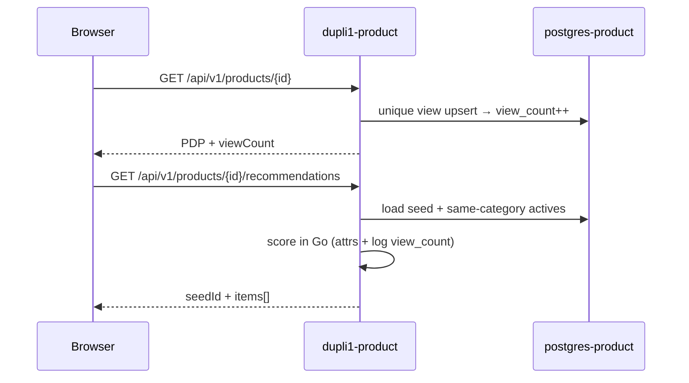

# Product Recommendations

How PDP “You may also like” works in **`dupli1-product`**.

**Status:** Implemented (content similarity + popularity). Co-view boost not started.  
**Planning history:** [product-views-recommendations-plan.md](product-views-recommendations-plan.md)  
**Depends on:** unique PDP views / `viewCount` — [product-guest-views-plan.md](product-guest-views-plan.md)

## Summary

Recommendations live **inside the product service** (no separate microservice, Neo4j, Redis, or ML). Given a seed parent product, the API returns other **active parents in the same category**, ranked by fixed weights on catalog attributes plus a soft `view_count` boost.

Weights are **not stored in Postgres**. They are constants in Go (`product/pkg/domain/recommend.go`). Postgres holds the inputs: brand, material, category, tags, price summary, and `view_count`.

## API

```http
GET /api/v1/products/{id}/recommendations?limit=8
```

| Property | Behavior |
|----------|----------|
| Auth | Public (no Bearer required) |
| Seed | Path `{id}` — must be an active parent; otherwise `404` |
| `limit` | Default `8`, clamped to 1–24; invalid → `400` |
| Unit | Parent products only (not variant SKUs) |
| Side effects | None — does not mint cookies or record views |

**Response `200`**

```json
{
  "seedId": "BOT-001",
  "items": [
    {
      "id": "BOT-014",
      "name": "…",
      "brand": "…",
      "category": "bags",
      "priceFrom": 189.0,
      "defaultImageUrl": "…",
      "viewCount": 420,
      "availableColors": ["Black", "Green"]
    }
  ]
}
```

| Field | Notes |
|-------|--------|
| `seedId` | Echo of the path id |
| `items` | Ordered related parents; empty array if none (never omit) |
| Score | **Not** exposed |

Also documented in [api.md](api.md) and [endpoints.md](endpoints.md).

## How ranking works

```text
1. Load active seed product
2. Search active parents (same category when seed has one), candidate cap 200
3. Score each candidate (exclude seed + non-active + other categories)
4. Sort by score DESC, then view_count DESC, then id ASC
5. Return top limit
```

### Score formula

Implemented in `domain.ScoreRecommendation`:

| Signal | Weight | Rule |
|--------|--------|------|
| Same brand | +5 | Prefer `brandCode`; else case-insensitive `brand` |
| Same material | +3 | Exact string match; empty seed material → no points |
| Shared tags | +2 × overlap | Cap at 3 overlapping tags |
| Price band | +2 | Candidate `priceFrom` within ±30% of seed `priceFrom` (both must be &gt; 0) |
| Popularity | `log10(view_count + 1)` | Soft boost; zero views still rank on attributes |

**Final score** = sum of the above.

Same-category filtering is required when the seed has a `category` (avoids bags↔shoes noise). If the seed has no category, category is not used as a filter.

### Example

Seed: brand `BOT`, material `leather`, tags `{tote, daily}`, `priceFrom` 200.

| Candidate | Pieces | Approx score |
|-----------|--------|--------------|
| Same brand + material + 1 tag + in band | 5+3+2+2 + log | ~12+ |
| Same brand only | 5 + log | ~5+ |
| No attr match, high views | log only | small |

### Why weights are not DB rows

| Approach | Choice |
|----------|--------|
| Constants in Go | v1 — simple, testable, versioned with code |
| Config / `recommendation_weights` table | Possible later if merchandising needs tuning without deploys |
| Per-product weight columns | Not used |

## Code map

| Layer | Location | Role |
|-------|----------|------|
| Route | `handler/routes.go` → `RouteProductRecommendations` | `GET …/products/{id}/recommendations` |
| Handler | `handler.PublicGetRecommendations` | Parse `limit`; JSON `{seedId, items}` |
| Service | `ProductSearchService.Recommend` | Load seed; search candidates; rank |
| Domain | `domain.ScoreRecommendation` / `RankRecommendations` | Weights + sort |
| Views input | `products.view_count` via guest unique views | Popularity signal |

Settings expose `"recommendations": true` in product settings (informational).

## Relationship to views



Views improve tie-breaking and soft ranking over time. Recommendations **never** write views.

## What is not included (yet)

| Idea | Status |
|------|--------|
| Co-view (“guests who viewed this also viewed…”) | Planned phase 2 — [product-views-recommendations-plan.md](product-views-recommendations-plan.md) |
| Also-bought from orders | Not started |
| Manual related-product pins | Not started |
| Homepage “for you” / trending feed | Out of scope (can reuse scorer later) |
| Separate recommendation service | Rejected for v1 |

## Frontend notes (`dupli1-web`)

- Prefer same-origin `/api/v1/products/{id}/recommendations`
- Load in parallel with or after PDP; do not block hero render
- Hide the rail when `items` is empty
- Reuse catalog cards; `viewCount` on items is optional to display

## Testing

Unit coverage: `domain/recommend_test.go`, `handler/views_recommendations_test.go`.

| Case | Expect |
|------|--------|
| Missing / inactive seed | `404` |
| Alone in category | `items: []` |
| Stronger attribute match | Higher rank |
| Higher `view_count` | Breaks score ties |
| Draft candidates | Excluded |
| Zero views everywhere | Still content-ranked |
