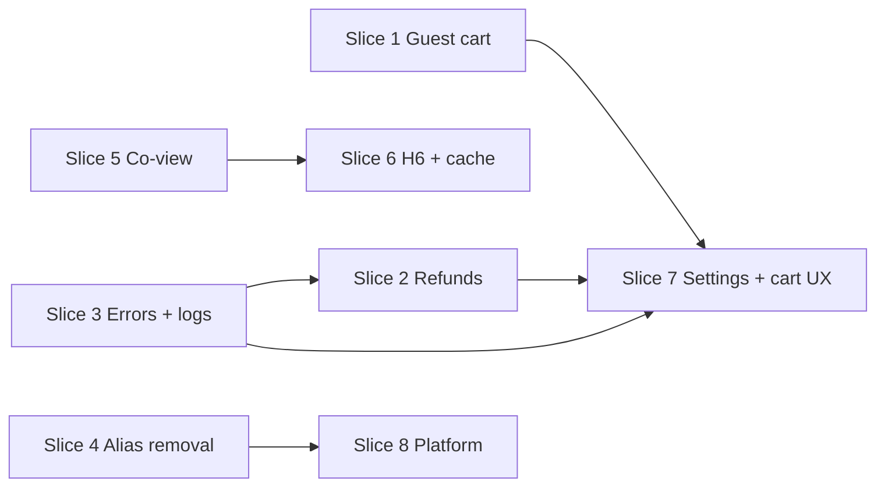

# Dupli1 v1.1 release plan

**Status:** Planning (2026-07-26)  
**Depends on:** [v1-release-plan.md](v1-release-plan.md) (v1.0 launch cut)  
**Scope:** Post-launch commerce UX, payment ops, discovery polish, and API cleanup in the `dupli1` backend (plus sibling-frontend callouts where required).

**Related:** [TODO.md](TODO.md), [current-state.md](current-state.md), [cart-service.md](cart-service.md), [payment-service.md](payment-service.md), [payment-methods-plan.md](payment-methods-plan.md), [product-guest-views-plan.md](product-guest-views-plan.md), [product-views-recommendations-plan.md](product-views-recommendations-plan.md), [manager-settings-api.md](manager-settings-api.md), [quality-bugs-fix-plan.md](quality-bugs-fix-plan.md), [product-error-wrapping.md](product-error-wrapping.md).

---

## Verdict

**v1.0** ships a reliable KRW card-checkout loop (catalog → cart → order → Stripe/Bypass → ship → stock commit).

**v1.1** makes that loop usable for anonymous shoppers, safer for ops (refunds), cleaner for clients (drop legacy API aliases), slightly smarter on the PDP (co-view recs + stock hints), and easier to debug (structured API errors + consistent log fields). It is still **not** “platform complete”: Bitcoin, chat, analytics services, and email/SMS stay later.

Assumption: v1.0 exit criteria in [v1-release-plan.md](v1-release-plan.md) are met (or accepted with runbook exceptions) before any v1.1 theme is tagged “done.”

---

## Goals

1. **Guest commerce** — browse → guest cart → login merge → checkout without forcing signup first.
2. **Ops money safety** — paid cancel can trigger an automated Stripe refund (not only Dashboard clicks).
3. **API hygiene** — one canonical path prefix per service; remove dual routes once clients migrate.
4. **Discovery polish** — co-view recommendations; optional PDP `inStock` enrichment.
5. **Store policy knobs** — first slice of manager settings (kill switches), not full settings surface.
6. **Correctness / latency leftovers** — product PG `context` (**H6**), Redis catalog cache, cart batch client.
7. **Observability** — well-structured API error bodies (stable machine `code`) and consistent structured log messages across services.

## Non-goals (defer past v1.1)

| Item | Why later |
|------|-----------|
| Bitcoin payment method | Explicitly planned; separate rails + TTL ([payment-methods-plan.md](payment-methods-plan.md)) |
| Chargebacks / dispute APIs | Payment phase 2+ after refunds exist |
| Email / SMS notifications | Telegram covers ops |
| Notification JetStream / DLQ | Log + queue group first; durable retries later |
| User / chat / analytics packages | Greenfield services |
| Password reset / OAuth / email verify | Ops or open-register covers early accounts |
| Formal SQL migrations directory | Inline migrate still acceptable |
| Local Compose TLS | Prod has ALB HTTPS |
| Drop legacy parent `color`/`stock`/`imageUrls` columns | Only after all readers use variants |
| Full manager-settings surface (every section) | Ship gates first; expand by need |
| Multi-currency | KRW only stays locked |

---

## Themes and priority

Work in this order unless a production incident forces a reorder. Themes can overlap in PRs when ownership does not collide (e.g. product recs vs cart guest).

```text
P0  Guest cart + merge          ── commerce unlock
P0  Refunds on paid cancel      ── ops money safety
P1  Structured errors + logs    ── cross-cutting (all services)
P1  Legacy API alias removal    ── after frontend migration
P1  Co-view recommendations     ── discovery
P2  H6 context + Redis cache    ── correctness / latency
P2  Manager settings (gates)    ── store policy
P2  Cart checkout helper + stock UX  ── convenience
P3  Platform hygiene            ── AWS/CI/docs
```

### Theme map

| Priority | Theme | Primary services | Design docs |
|----------|-------|------------------|-------------|
| **P0** | Guest cart + merge on login | cart (+ product cookie contract) | [cart-service.md](cart-service.md), [product-guest-views-plan.md](product-guest-views-plan.md) |
| **P0** | Paid cancel → Stripe refund | payment, order | [payment-service.md](payment-service.md) |
| **P1** | Structured API errors + log messages | all services | [product-error-wrapping.md](product-error-wrapping.md), [api.md](api.md) |
| **P1** | Remove legacy API aliases + nginx locations | gateway, product, order, cart; **frontends** | [TODO.md](TODO.md) path table |
| **P1** | Co-view / also-bought recommendations | product | [product-views-recommendations-plan.md](product-views-recommendations-plan.md) |
| **P2** | Product PG request `context` (**H6**) | product | [quality-bugs-fix-plan.md](quality-bugs-fix-plan.md) |
| **P2** | Redis catalog cache + cart batch `sku_ids` client | product, cart | [TODO.md](TODO.md) |
| **P2** | Manager settings — login/checkout/payment gates | auth (+ NATS consumers) | [manager-settings-api.md](manager-settings-api.md) |
| **P2** | `POST /api/v1/cart/checkout` | cart → order | [cart-service.md](cart-service.md) |
| **P2** | Stock on add-to-cart + PDP `inStock` enrichment | cart, product | [cart-service.md](cart-service.md), [product-variants-plan.md](product-variants-plan.md) |
| **P2** | Auth-aware draft PDP for managers | product | [TODO.md](TODO.md) Product API |
| **P2** | SKU master Phase D (manage-web UI) | **manage-web** (sibling) | [product-sku-master-data-plan.md](product-sku-master-data-plan.md) |
| **P3** | AWS cost orphan cleanup, CI OIDC, ALB `:80` redirect align | infra | [aws-cost-reduction-plan.md](aws-cost-reduction-plan.md) |
| **P3** | Align frontend CI task defs with live EC2 bridge | sibling CI | [deployment-aws.md](deployment-aws.md) |
| **P3** | Re-lock `AUTH_OPEN_REGISTER` when storefront no longer needs it | auth + web | [TODO.md](TODO.md) |

---

## Delivery slices

Each slice should be independently shippable behind existing auth/permissions (no big-bang release). Prefer small PRs with tests in the owning module.

### Slice 1 — Guest cart + merge (P0)

**Outcome:** Anonymous shoppers keep a cart; login merges into the JWT cart without losing lines.

| Step | Work |
|------|------|
| 1 | Reuse `dupli1_guest` cookie contract from product; cart mints cookie if absent on first guest cart mutation |
| 2 | Persist guest cart keyed by `guest_id` (same item model as customer cart) |
| 3 | Public/guest cart routes (or cookie-auth path) for CRUD without JWT |
| 4 | On login/refresh → merge guest lines into customer cart (qty rules: sum or max — pick one, document, test) |
| 5 | Clear or detach guest cart after successful merge |
| 6 | Storefront: call guest cart before auth; trigger merge after login |

**Done when:** Guest can add items, refresh, log in, and see merged cart; checkout still requires authenticated customer (order ABAC unchanged unless explicitly extended later).

**Out of slice:** Guest checkout without account (v1.2+ if ever required).

### Slice 2 — Refunds on paid cancel (P0)

**Outcome:** Canceling a **paid** order initiates a Stripe refund and keeps payment/order state consistent.

| Step | Work |
|------|------|
| 1 | Define API: likely order cancel (ops) → payment refund command, or `POST /api/v1/payments/{id}/refund` with permission |
| 2 | Persist refund intent + Stripe refund id; idempotent on retry |
| 3 | Map Stripe refund webhook / poll → payment status; order stays/moves to `canceled` per [payment-service.md](payment-service.md) |
| 4 | Bypass payments: mark refunded without Stripe |
| 5 | Inventory: ensure cancel path releases or does not double-commit (paid but unshipped vs `in_transit`) |
| 6 | Manage-web: cancel-paid action wired to new API |

**Done when:** Ops can cancel a paid, unshipped order and see Stripe refund + order `canceled` without Dashboard; shipped (`in_transit`+) policy is documented (block cancel or require return flow).

**Out of slice:** Chargebacks, partial line refunds, store credit, Bitcoin.

### Slice 3 — Structured API errors & logs (P1)

**Outcome:** Every service returns a predictable error JSON shape with stable machine codes; server logs carry enough structure to trace failures without leaking internals to clients.

**Today (partial):**

| Piece | State |
|-------|--------|
| Product | Sentinel mapping + sanitized 500s — [product-error-wrapping.md](product-error-wrapping.md) |
| Order / cart / payment | `{ "error": "…", "code": <http status int> }` — `code` is not a machine identifier |
| Auth (Gin) | `{ "error": "…" }` only — no `code` field |
| Logging | Ad hoc `log.Printf("service: …")`; no shared fields (request id, route, operation) |

**Target contract:**

```json
{
  "error": "human-readable message",
  "code": "order.checkout.session_expired"
}
```

- `code` is a **stable dot-separated string** (`<service>.<domain>.<reason>`), not the HTTP status.
- HTTP status remains on the response line only.
- **500 / unexpected:** body stays generic (`internal error`); full cause logged server-side only.
- Settings gates and future refund flows should reuse the same pattern (see examples in [manager-settings-api.md](manager-settings-api.md)).

**Log contract (server-side):**

- Use structured logging (`log/slog` or equivalent) with consistent keys: `service`, `op`, `error`, and when available `request_id`, `route`, `customer_id` / `order_id` (no secrets, no card data).
- Classified client errors (4xx): log at **info** or **warn** with `code`; unexpected 500s at **error** with wrapped chain.

| Step | Work |
|------|------|
| 1 | Add shared HTTP error helper in `shared/` (stdlib + Gin adapter) — single envelope + code constants registry per service |
| 2 | Define initial code catalog for money path: cart, checkout, order, payment, inventory, auth (login/register/forbidden) |
| 3 | Migrate order, cart, payment handlers off numeric `code`; add codes to product `respondError` |
| 4 | Migrate auth Gin handlers to the same envelope |
| 5 | Replace scattered `log.Printf` on error paths with structured fields; keep existing sanitized 500 behavior |
| 6 | Update [api.md](api.md), OpenAPI specs, and handler tests (assert `code` string, not status int) |

**Done when:** A client can branch on `code` for common failures (e.g. `cart.variant_not_found`, `payment.order_not_payable`, `auth.login_disabled`); CloudWatch/log grep can filter by `service` + `code`; no SQL/driver text in JSON bodies.

**Out of slice:** Distributed tracing (OpenTelemetry), log aggregation infra changes, i18n of `error` strings.

### Slice 4 — Legacy alias removal (P1)

**Prereq:** Storefront + manage-web + any external callers use canonical paths only ([TODO.md](TODO.md) mapping).

| Step | Work |
|------|------|
| 1 | Audit gateway access logs / frontend code for legacy prefixes |
| 2 | Remove dual HTTP routes in product/order/cart |
| 3 | Remove matching nginx locations (`variants`, `coupons`, `catalog`, `inventory`, `checkout`, `carts`) |
| 4 | Refresh OpenAPI + [endpoints.md](endpoints.md) |

**Done when:** Only `/api/v1/{service}/…` paths remain for those resources; smoke tests pass through gateway.

### Slice 5 — Co-view recommendations (P1)

**Prereq:** Unique views + content/popularity recs already live.

| Step | Work |
|------|------|
| 1 | Persist co-view pairs (or session windows) from `product_views` / guest journeys per [product-views-recommendations-plan.md](product-views-recommendations-plan.md) phase 2 |
| 2 | Blend co-view into `GET /api/v1/products/{id}/recommendations` with clear ranking rules |
| 3 | Cold-start fallback remains content + popularity |

**Done when:** PDP recommendations improve for products with shared viewers; empty-history products still get content recs.

### Slice 6 — Correctness & latency (P2)

| Item | Done when |
|------|-----------|
| **H6** request `context` through product PG stores | Queries honor cancel/deadline; tests cover timeout path |
| Redis catalog cache | Hot parent/variant reads cacheable; invalidation on write |
| Cart uses `GET …/variants?sku_ids=` | Enrichment is 1 request (or bounded pages), not N |

### Slice 7 — Manager settings + cart convenience (P2)

| Item | Done when |
|------|-----------|
| Settings host in auth: `allow_login`, `allow_register`, `allow_checkout`, `allow_payments` (minimal) | `GET\|PATCH /api/v1/settings/{section}` with `settings.*`; NATS `settings.updated`; services enforce **403** with stable codes — [manager-settings-api.md](manager-settings-api.md) |
| `POST /api/v1/cart/checkout` | Creates order checkout session from cart lines; client one-shot handoff |
| Stock enforcement on add | Reject or clamp qty when available_qty insufficient (define soft vs hard) |
| PDP `inStock` enrichment | Public PDP includes availability hint without mandatory client inventory round trip |
| Auth-aware draft PDP | Optional Bearer + `product.read` shows drafts/cost on same path as public PDP |

### Slice 8 — Platform hygiene (P3)

Track in [TODO.md](TODO.md) / AWS docs; do not block commerce slices:

- Cost orphan cleanup ([aws-cost-reduction-plan.md](aws-cost-reduction-plan.md))
- Backend CI OIDC
- ALB HTTP→HTTPS redirect alignment
- Frontend CI task-def parity with live EC2 bridge
- Re-lock open register when appropriate
- SKU master Phase D UI in manage-web

---

## Cross-repo coordination

| Repo | v1.1 impact |
|------|-------------|
| `dupli1` (this) | All backend slices |
| `dupli1-web` | Guest cart UX; canonical paths; recs UI unchanged; optional cart/checkout helper |
| `dupli1-manage-web` | Paid cancel/refund; settings toggles; SKU master Phase D; canonical paths |

Frontend path migration (**P1 prereq for Slice 3**) may start during v1.0; v1.1 owns **removal** of aliases.

---

## Suggested sequencing (backend)



- **S1 and S2 in parallel** (different services); **S3 before or alongside S2** so refund/cancel paths ship with stable `code`s.
- **S3** is cross-cutting — land shared helper first, then migrate services in money-path order.
- **S4** after frontend migration signal.
- **S5** independent of cart/payment.
- **S6** anytime after P0; nice before heavy traffic.
- **S7** after S1 if checkout helper should support guest→login flow; settings can start earlier (reuse S3 error codes).
- **S8** continuous / opportunistic.

---

## Exit criteria (tag v1.1)

Ship when all are true:

- [ ] Guest cart works with `dupli1_guest`; merge-on-login preserves lines
- [ ] Ops can cancel a paid unshipped order and get an automated Stripe (or Bypass) refund
- [ ] All services return stable machine `code` strings on errors; structured logs on failure paths
- [ ] Legacy top-level API aliases removed from services + nginx
- [ ] Co-view blended into PDP recommendations (with content fallback)
- [ ] H6 context plumbing landed; Redis catalog cache or explicit deferral note in TODO
- [ ] Minimal manager settings gates live **or** explicitly deferred with reason
- [ ] [TODO.md](TODO.md) and [current-state.md](current-state.md) updated for what shipped vs moved to v1.2

---

## Doc maintenance

- This file is the **v1.1 release boundary**; [TODO.md](TODO.md) remains the living checklist.
- [v1-release-plan.md](v1-release-plan.md) keeps the v1.0 cut; point its “postpone / first slice” section here.
- When a slice ships, flip status in the theme table and trim [current-state.md](current-state.md) “Known gaps.”
- Do not invent parallel plan docs for items that already have designs — link and execute those designs instead.
