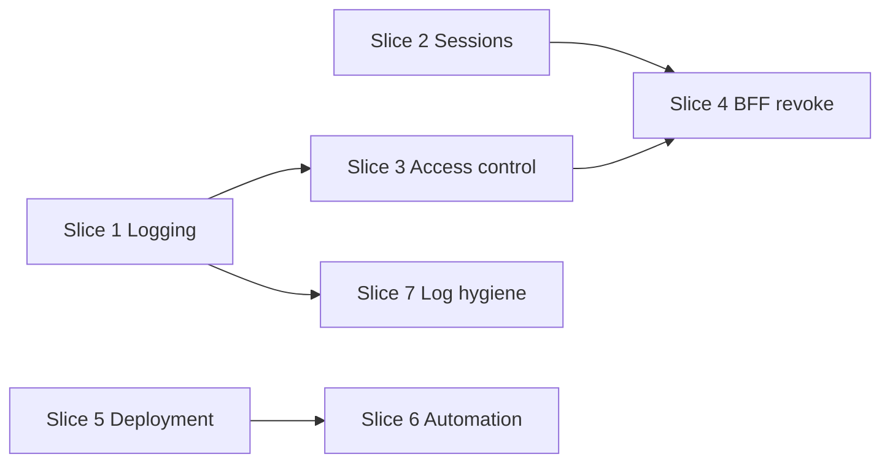

# Dupli1 v1.1 release plan

**Status:** Planning (2026-07-26) — **blocked on v1.0** (postponed 2026-07-27 until [v1.0-release-spec.md](v1.0-release-spec.md) closeout is complete)  
**Depends on:** [v1-release-plan.md](v1-release-plan.md) (v1.0 launch cut)  
**Scope:** Post-launch **platform** work — **logging**, **sessions & access control**, **deployment**, and **automation**. Minimal product/commerce feature changes.

**Related:** [TODO.md](TODO.md), [current-state.md](current-state.md), [api.md](api.md), [permissions.md](permissions.md), [deployment-aws.md](deployment-aws.md), [aws-cost-reduction-plan.md](aws-cost-reduction-plan.md), [quality-bugs-fix-plan.md](quality-bugs-fix-plan.md), [product-error-wrapping.md](product-error-wrapping.md).

---

## Verdict

**v1.0** ships a reliable KRW card-checkout loop (catalog → cart → order → Stripe/Bypass → ship → stock commit).

**v1.1** hardens how the stack runs in production:

1. **Logging** — structured API errors and consistent log fields  
2. **Sessions** — one consistent refresh-session model end-to-end  
3. **Access control** — verify ABAC + permissions match [permissions.md](permissions.md)  
4. **BFF revocation** — `dupli1-web` (and manage-web) can end a session and revoke the refresh token server-side  
5. **Deployment & automation** — AWS/Terraform alignment, CI OIDC, deploy smoke  

Commerce UX (guest cart, refunds, co-view, settings, and similar) moves to **v1.2** — see [deferred to v1.2](#deferred-to-v12).

Assumption: v1.0 is **not postponed** — all exit criteria in [v1.0-release-spec.md](v1.0-release-spec.md) must be met and `v1.0` tagged before v1.1 work starts.

---

## Goals

| # | Goal | Outcome |
|---|------|---------|
| 1 | **Logging** | Stable machine `code` on API errors; **zerolog** with consistent fields on all services |
| 2 | **Consistent sessions** | One contract for login → refresh → access across auth API and BFFs (cookie attrs, TTLs, who holds the refresh token) |
| 3 | **Verify access control** | ABAC + permission matrix audited; gaps fixed; negative tests on money-path routes |
| 4 | **Revocable session from BFF** | Logout from the storefront/admin BFF revokes the auth refresh session and clears the browser cookie |
| 5 | **Deployment** | Live AWS/ECS/ALB/nginx matches Terraform; cost orphans cleaned up |
| 6 | **Automation** | CI OIDC, workflow alignment, post-deploy smoke gates |

## Non-goals (defer to v1.2+)

| Item | Why not v1.1 |
|------|----------------|
| Guest cart / merge, refunds, co-view recs | Commerce — v1.2 |
| Legacy API alias removal | Frontend migration first — v1.2 |
| Manager settings API, H6, Redis cache | Product surface — v1.2 |
| Formal SQL migrations directory | Not blocking |
| Local Compose TLS | Prod has ALB HTTPS |

---

## Themes and priority

```text
P0  Structured errors + logs        ── observability
P0  Consistent sessions              ── auth + BFF contract
P0  Verify access control            ── ABAC / permissions audit + tests
P0  BFF revocable logout             ── dupli1-web / manage-web
P0  Deployment alignment              ── AWS / ECS / ALB / nginx
P1  CI/CD automation                  ── OIDC, workflows, smoke
P2  Runtime log hygiene               ── NATS, register publish, request id
```

### Theme map

| Priority | Theme | Primary area | Design docs |
|----------|-------|--------------|-------------|
| **P0** | Structured API errors + **zerolog** logging | all Go services | [product-error-wrapping.md](product-error-wrapping.md), [api.md](api.md) |
| **P0** | Consistent refresh sessions | auth + **dupli1-web** / manage-web | [api.md](api.md) (auth flow, BFF service account) |
| **P0** | Verify access control (ABAC + permissions) | order, cart, payment, product, auth | [permissions.md](permissions.md) |
| **P0** | Revocable session from BFF | **dupli1-web**, auth | [api.md](api.md) (`POST /auth/logout`) |
| **P0** | AWS cost orphan cleanup, ALB redirect, nginx/ECS align | infra | [aws-cost-reduction-plan.md](aws-cost-reduction-plan.md), [deployment-aws.md](deployment-aws.md) |
| **P1** | Backend CI OIDC + frontend task-def alignment | `.github/workflows/` | [deployment-aws.md](deployment-aws.md) |
| **P1** | Post-deploy smoke workflow | CI | [deployment-aws.md](deployment-aws.md) |
| **P2** | Notification NATS errors logged; auth register soft-success | notification, auth | [v1-release-plan.md](v1-release-plan.md) |
| **P2** | Request correlation id in logs | gateway + services | — |

---

## Delivery slices

### Slice 1 — Structured API errors & zerolog (P0)

**Outcome:** Predictable error JSON + **zerolog** structured logs across all services.

**Today (partial):**

| Piece | State |
|-------|--------|
| Auth | **zerolog** — JSON or console via `LogOutput` / `LogLevel`; handlers use `.Str("event", …).Err(err).Msg(…)`; catalog + rules in [auth-logging.md](auth-logging.md) |
| Product | `log.Printf` on internal errors and view side effects |
| Order / cart / payment / notification | `log.Printf` on 500s, outbox drain, NATS handlers |

**Target:** Every service uses `github.com/rs/zerolog` (same library as auth). No `log/slog` and no ad hoc `log.Printf` on request/error paths.

**Target API envelope:**

```json
{
  "error": "human-readable message",
  "code": "auth.session.expired"
}
```

**Target log contract (zerolog):**

- Shared factory in `shared/pkg/log` (extract from auth’s `newLogger`): `json` in prod, `console` locally; level from env.
- Root logger per process: `.With().Str("service", "order").Logger()` at bootstrap.
- Per-event fields: `op`, `code`, `err`, and when available `request_id`, `route`, `user_id` / `customer_id` (never log refresh tokens, passwords, or card data).
- Levels: classified 4xx → **warn** or **info** with `code`; unexpected 500 → **error** with wrapped `err`.

| Step | Work |
|------|------|
| 1 | Add `shared/pkg/log` — zerolog factory + optional Gin/stdlib request middleware |
| 2 | Shared HTTP error helper in `shared/` (stdlib + Gin adapter) |
| 3 | Code catalog: auth sessions, cart, checkout, order, payment, inventory |
| 4 | Wire zerolog through product, order, cart, payment, notification bootstrap + handlers; replace `log.Printf` |
| 5 | Align auth on shared factory (keep existing field names / `event` where already stable) |
| 6 | Update [api.md](api.md), OpenAPI, tests; add `zerolog` to each service `go.mod` |

**Done when:** CloudWatch/log grep filters by `service` + `code`; all six services emit zerolog JSON in prod; no SQL/driver text in JSON bodies.

**Out of slice:** OpenTelemetry / distributed tracing, log aggregation infra changes.

### Slice 2 — Consistent sessions (P0)

**Outcome:** Auth, gateway, and BFFs agree on how refresh sessions are created, stored, refreshed, and expired.

**Today (gaps):**

| Piece | State |
|-------|--------|
| Login | `POST /api/v1/auth/login` → `{ "refresh_token": "<jwt>" }` in JSON only |
| Cookie options | `dupli1_session` configured in auth (`CookieName`, `Secure`, `HttpOnly`) but **not set on login** |
| Session store | Redis-backed `SessionStore` revokes refresh tokens on logout when wired |
| Refresh | `POST /api/v1/auth/refresh` with body `{ "refresh_token" }` → `{ "token" }` access JWT |
| BFF | [api.md](api.md) says `dupli1-web` should keep refresh server-side — implementation may still pass token to the browser |
| Access token | Short-lived; permissions reloaded from DB on each refresh ([permissions.md](permissions.md)) |

**Target contract:**

```text
Browser  ←HttpOnly cookie dupli1_session→  BFF (dupli1-web / manage-web)
                                              │
                    refresh_token (server only)│ POST /api/v1/auth/refresh
                                              ▼
                                         dupli1-auth (+ Redis session store)
                                              │
                    access JWT (memory only)  │  Bearer to gateway / APIs
                                              ▼
                                         order / cart / payment / product
```

| Attribute | Value |
|-----------|--------|
| Refresh token | **Never** exposed to browser JS; held by BFF or HttpOnly cookie readable only by BFF/auth |
| Cookie | `dupli1_session` — `HttpOnly`, `Secure` (prod), `SameSite=Lax`, `Path=/` |
| TTL | Match `RefreshTokenExpiry` (auth) and BFF cookie `Max-Age` |
| Refresh | BFF calls auth refresh before access token expiry; browser calls BFF, not auth directly |
| Service accounts | `dupli1-web` machine login stays server-side only (unchanged) |

| Step | Work |
|------|------|
| 1 | Document session contract in [api.md](api.md) (browser vs BFF vs direct API clients) |
| 2 | Auth: optional `Set-Cookie` on login when `Accept-Cookie` / BFF mode; keep JSON body for service clients |
| 3 | Auth: refresh/logout accept refresh from HttpOnly cookie **or** JSON body (BFF + tests) |
| 4 | **dupli1-web**: login route sets session cookie; API routes attach Bearer from server-side refresh |
| 5 | manage-web: same pattern if it uses user login (not only service account) |
| 6 | Integration test: login → refresh → access API → logout → refresh fails |

**Done when:** Storefront login does not put `refresh_token` in `localStorage`; cookie attrs and TTLs match docs; refresh works through BFF without client-visible refresh JWT.

### Slice 3 — Verify access control (P0)

**Outcome:** Documented permission matrix matches runtime behavior; known ABAC holes closed.

**Scope:** Money path + user admin — routes in [permissions.md](permissions.md) and [api.md](api.md).

| Area | Checks |
|------|--------|
| **Order / checkout** | Customer `sub` must match `customer_id` / session owner; `order.create` / `order.read.all` bypass only when permitted; ship/status permissions enforced |
| **Cart** | Own-cart only; `cart.read` for admin |
| **Payment** | Own-order ABAC; `payment.create` / `payment.read.all`; `payment.bypass` gated |
| **Product** | Per-route permissions; public vs protected inventory reads |
| **Auth** | Register ABAC hierarchy; `user.*` permissions; open-register temporary flag documented |

| Step | Work |
|------|------|
| 1 | Build route × permission × ABAC matrix from [permissions.md](permissions.md) |
| 2 | Extend handler tests (pattern: [product/pkg/handler/access_control_test.go](../product/pkg/handler/access_control_test.go), order checkout ABAC tests) for cart, payment, auth gaps |
| 3 | Manual or scripted negative probes on staging (wrong `sub`, missing perm, expired token) |
| 4 | Fix any drift; record results in [permissions.md](permissions.md) or a short `auth-access-control-verification.md` if needed |

**Done when:** Matrix is green for all money-path routes; no `requireAuth` no-op paths in prod bootstrap (**H7** remains enforced); PR includes tests for every fixed gap.

### Slice 4 — Revocable session from BFF (P0)

**Outcome:** User logout from the storefront (or admin) immediately ends the refresh session server-side.

**Depends on:** Slice 2 (BFF holds refresh token / cookie).

| Step | Work |
|------|------|
| 1 | BFF `POST /api/auth/logout` (or equivalent): read session cookie / server store → `POST /api/v1/auth/logout` with refresh token |
| 2 | Clear `dupli1_session` cookie (`Max-Age=0`) and drop any in-memory access token cache |
| 3 | Verify `SessionStore.Delete` in auth (Redis in prod) — refresh after logout returns `401` |
| 4 | Optional: logout all sessions for user (admin) — **out of slice** unless required |
| 5 | Storefront E2E: login → cart call works → logout → cart returns `401` |

**Done when:** Logout from BFF revokes refresh in Redis; replaying the old refresh token fails; cookie is cleared in the browser.

### Slice 5 — Deployment alignment (P0)

| Step | Work |
|------|------|
| 1 | [aws-cost-reduction-plan.md](aws-cost-reduction-plan.md) Phases 1–2 |
| 2 | ALB `:80` → HTTPS redirect matches Terraform |
| 3 | Gateway uses `api/nginx.ecs.conf`; JWT signing key persistent in Secrets Manager |
| 4 | Update [deployment-aws.md](deployment-aws.md) and [current-state.md](current-state.md) |

### Slice 6 — CI/CD automation (P1)

| Step | Work |
|------|------|
| 1 | Backend deploy via OIDC (`github-actions-deploy-role`) |
| 2 | Align `dupli1-web` / `dupli1-manage-web` CI with live EC2 bridge task defs |
| 3 | Post-deploy smoke: gateway health + optional authenticated curl |
| 4 | Document release runbook |

### Slice 7 — Runtime log hygiene (P2)

| Item | Done when |
|------|-----------|
| Notification NATS handler errors logged | Visible in CloudWatch |
| Auth `user.registered` soft-success publish | User row survives NATS flap |
| Request correlation id | `X-Request-Id` in gateway + `request_id` in service logs |

---

## Cross-repo coordination

| Repo | v1.1 impact |
|------|-------------|
| `dupli1` (this) | Logging, auth session cookie/body, access-control tests/fixes, CI/deploy |
| `dupli1-web` | **Sessions slice** — cookie session, server-side refresh, **logout/revoke** |
| `dupli1-manage-web` | Same session/logout pattern if using human login; CI task-def alignment |

---

## Suggested sequencing



- **S1** early — new auth/session errors use stable `code`s from day one.  
- **S2 → S4** — consistent sessions before BFF logout.  
- **S3** in parallel with **S2** (backend tests); finish before tag.  
- **S5 / S6** — infra track, independent of auth.  
- **S7** after **S1**.

---

## Exit criteria (tag v1.1)

- [ ] Stable machine `code` on API errors; **zerolog** JSON logs on all six services
- [ ] Session contract documented and implemented: BFF holds refresh; `dupli1_session` cookie consistent
- [ ] Access-control matrix verified; money-path negative tests pass
- [ ] BFF logout revokes refresh session and clears cookie
- [ ] AWS deployment aligned; CI OIDC + smoke workflow live
- [ ] [TODO.md](TODO.md) and [current-state.md](current-state.md) updated; commerce backlog in v1.2

---

## Deferred to v1.2

| Theme | Items |
|-------|--------|
| Commerce UX | Guest cart + merge; cart checkout helper; stock on add; PDP `inStock` |
| Payments | Paid cancel → Stripe refund |
| Discovery | Co-view recommendations |
| API cleanup | Legacy path alias removal |
| Platform product | Manager settings; H6; Redis cache; SKU master Phase D UI |

---

## Doc maintenance

- This file is the **v1.1 release boundary** (logging, sessions, access control, deployment, automation).
- [v1-release-plan.md](v1-release-plan.md) keeps the v1.0 cut.
- [TODO.md](TODO.md) remains the living checklist.
