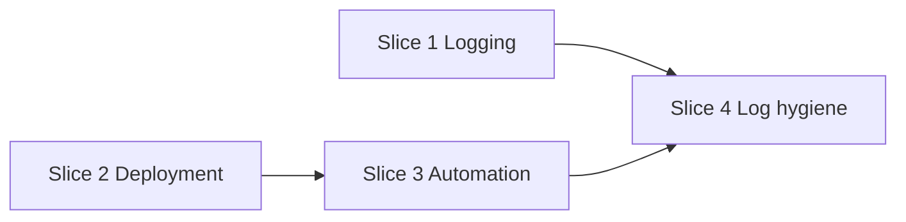

# Dupli1 v1.1 release plan

**Status:** Planning (2026-07-26)  
**Depends on:** [v1-release-plan.md](v1-release-plan.md) (v1.0 launch cut)  
**Scope:** Post-launch **platform** work — logging, deployment alignment, and CI/CD automation. Minimal product/commerce feature changes.

**Related:** [TODO.md](TODO.md), [current-state.md](current-state.md), [deployment-aws.md](deployment-aws.md), [aws-cost-reduction-plan.md](aws-cost-reduction-plan.md), [quality-bugs-fix-plan.md](quality-bugs-fix-plan.md), [product-error-wrapping.md](product-error-wrapping.md).

---

## Verdict

**v1.0** ships a reliable KRW card-checkout loop (catalog → cart → order → Stripe/Bypass → ship → stock commit).

**v1.1** hardens how the stack runs in production: **structured logging**, **deployment** alignment with Terraform and AWS reality, and **automation** of build/deploy/smoke paths. Commerce UX (guest cart, refunds, co-view, settings, and similar) moves to **v1.2** — see [v1.2 backlog](#deferred-to-v12) below.

Assumption: v1.0 exit criteria in [v1-release-plan.md](v1-release-plan.md) are met (or accepted with runbook exceptions) before v1.1 is tagged.

---

## Goals

1. **Logging** — well-structured API error bodies (stable machine `code`) and consistent structured log messages across all services.
2. **Deployment** — live AWS/ECS/ALB/nginx state matches Terraform and docs; cost orphans cleaned up; deploy runbooks trustworthy.
3. **Automation** — CI uses OIDC (no long-lived AWS keys); workflows match live EC2 bridge task defs; post-deploy smoke checks gate releases.

## Non-goals (defer to v1.2+)

See [deferred to v1.2](#deferred-to-v12). v1.1 does **not** own guest cart, refunds, catalog discovery, manager settings, or legacy API alias removal.

| Item | Why not v1.1 |
|------|----------------|
| Guest cart / merge, refunds, co-view recs | Commerce release — v1.2 |
| Legacy API alias removal | Needs frontend migration first — v1.2 |
| Manager settings API | Product/policy surface — v1.2 |
| H6 context, Redis catalog cache | Latency/correctness polish — v1.2 |
| Formal SQL migrations directory | Not blocking ops |
| Local Compose TLS | Prod has ALB HTTPS |

---

## Themes and priority

```text
P0  Structured errors + logs     ── observability (all services)
P0  Deployment alignment         ── AWS / ECS / ALB / nginx / cost
P1  CI/CD automation             ── OIDC, workflows, smoke gates
P2  Runtime log hygiene          ── NATS handlers, register publish, request correlation
```

### Theme map

| Priority | Theme | Primary area | Design docs |
|----------|-------|--------------|-------------|
| **P0** | Structured API errors + `slog` logging | all Go services | [product-error-wrapping.md](product-error-wrapping.md), [api.md](api.md) |
| **P0** | AWS cost orphan cleanup | infra | [aws-cost-reduction-plan.md](aws-cost-reduction-plan.md), [aws-cost-optimization.md](aws-cost-optimization.md) |
| **P0** | ALB HTTP→HTTPS redirect align with Terraform | infra | [deployment-aws.md](deployment-aws.md) |
| **P0** | Confirm live gateway uses `nginx.ecs.conf` (not broken `nginx.prod.conf`) | `api/` | [v1-release-plan.md](v1-release-plan.md) |
| **P1** | Backend CI OIDC (`github-actions-deploy-role`) | `.github/workflows/` | [deployment-aws.md](deployment-aws.md), [infra/terraform/README.md](../infra/terraform/README.md) |
| **P1** | Align `dupli1-web` / `dupli1-manage-web` CI task defs with live EC2 bridge | sibling repos + CI | [deployment-aws.md](deployment-aws.md) |
| **P1** | Post-deploy smoke workflow (gateway health + money-path curl) | CI + [deployment-aws.md](deployment-aws.md) | — |
| **P2** | Log notification NATS handler failures (stop silent discard) | notification | [v1-release-plan.md](v1-release-plan.md) |
| **P2** | Auth `user.registered` soft-success publish (NATS flap must not roll back user) | auth | [v1-release-plan.md](v1-release-plan.md) |
| **P2** | Request correlation id in logs (middleware + propagate where cheap) | gateway + services | — |

---

## Delivery slices

Each slice should be independently shippable. Prefer small PRs with tests where applicable.

### Slice 1 — Structured API errors & logs (P0)

**Outcome:** Every service returns a predictable error JSON shape with stable machine codes; server logs carry enough structure to trace failures without leaking internals to clients.

**Today (partial):**

| Piece | State |
|-------|--------|
| Product | Sentinel mapping + sanitized 500s — [product-error-wrapping.md](product-error-wrapping.md) |
| Order / cart / payment | `{ "error": "…", "code": <http status int> }` — `code` is not a machine identifier |
| Auth (Gin) | `{ "error": "…" }` only — no `code` field |
| Logging | Ad hoc `log.Printf("service: …")`; no shared fields (request id, route, operation) |

**Target API envelope:**

```json
{
  "error": "human-readable message",
  "code": "order.checkout.session_expired"
}
```

- `code` is a **stable dot-separated string** (`<service>.<domain>.<reason>`), not the HTTP status.
- **500 / unexpected:** body stays generic (`internal error`); full cause logged server-side only.

**Target log contract:**

- Use `log/slog` with consistent keys: `service`, `op`, `code`, `error`, and when available `request_id`, `route`, `customer_id` / `order_id` (no secrets, no card data).
- Classified 4xx: **info** or **warn** with `code`; unexpected 500s: **error** with wrapped chain.

| Step | Work |
|------|------|
| 1 | Shared HTTP error helper in `shared/` (stdlib + Gin adapter) |
| 2 | Code catalog for money path: auth, cart, checkout, order, payment, inventory |
| 3 | Migrate order, cart, payment, auth handlers; extend product `respondError` |
| 4 | Replace `log.Printf` on error paths with structured `slog` |
| 5 | Update [api.md](api.md), OpenAPI specs, handler tests |

**Done when:** CloudWatch/log grep can filter by `service` + `code`; clients can branch on stable codes for common failures; no SQL/driver text in JSON bodies.

**Out of slice:** OpenTelemetry / distributed tracing, log aggregation infra changes.

### Slice 2 — Deployment alignment (P0)

**Outcome:** What Terraform and docs describe is what runs in production; known orphans and config drift are resolved.

| Step | Work |
|------|------|
| 1 | Run [aws-cost-reduction-plan.md](aws-cost-reduction-plan.md) Phases 1–2 (ASG shrink, Global Accelerator removal, orphan script) |
| 2 | Align ALB `:80` default action with Terraform HTTP→HTTPS redirect |
| 3 | Verify ECS services use current task defs; gateway task uses `api/nginx.ecs.conf` |
| 4 | Reconcile Secrets Manager / JWT signing key persistence per [deployment-aws.md](deployment-aws.md) |
| 5 | Update [deployment-aws.md](deployment-aws.md) and [current-state.md](current-state.md) with post-change inventory |

**Done when:** Cost baseline matches shrunk target; ALB redirect behavior matches Terraform; gateway smoke passes on prod URL; no stale orphan resources from the plan’s inventory.

### Slice 3 — CI/CD automation (P1)

**Outcome:** Builds and deploys run without long-lived AWS access keys; frontend workflows match live EC2 bridge layout; releases can be gated on smoke.

| Step | Work |
|------|------|
| 1 | Switch `.github/workflows/aws.yml` (and related) to OIDC `github-actions-deploy-role` |
| 2 | Remove or rotate dependence on `AWS_ACCESS_KEY_ID` repo secrets for backend deploy |
| 3 | Align `dupli1-web` / `dupli1-manage-web` workflows: EC2 `bridge`, family `dupli1-web`, container `web` (not Fargate/`awsvpc` drift) |
| 4 | Add workflow job: post-deploy smoke (`GET /gateway/health`, optional authenticated money-path curl against staging/prod) |
| 5 | Document release steps in [deployment-aws.md](deployment-aws.md) |

**Done when:** A merge to `main` (or tag) can build, push, deploy, and fail the workflow if smoke fails — all via OIDC.

### Slice 4 — Runtime log hygiene (P2)

Small, launch-adjacent fixes that improve signal in logs without new product features.

| Item | Done when |
|------|-----------|
| Notification NATS handler errors logged (not discarded) | Failures visible in CloudWatch with `service=notification` |
| Auth `user.registered` publish soft-success | User row survives NATS flap; error logged |
| Request correlation id | Gateway or middleware sets `X-Request-Id`; services include `request_id` in `slog` when present |

---

## Cross-repo coordination

| Repo | v1.1 impact |
|------|-------------|
| `dupli1` (this) | Logging, backend CI OIDC, deploy/smoke workflows, notification/auth log fixes |
| `dupli1-web` | CI task-def alignment only (no feature work required) |
| `dupli1-manage-web` | CI task-def alignment only |

---

## Suggested sequencing



- **S1** can start immediately (no infra dependency).
- **S2** and **S3** overlap once Terraform changes are reviewable; **S3 smoke** should run against post-**S2** environment.
- **S4** after **S1** so new code paths use `slog` + `request_id`.

---

## Exit criteria (tag v1.1)

Ship when all are true:

- [ ] All services return stable machine `code` strings on errors; structured `slog` on failure paths
- [ ] AWS cost/orphan cleanup applied per plan; ASG at shrunk target
- [ ] ALB HTTP→HTTPS redirect matches Terraform
- [ ] Backend CI deploys via OIDC (no long-lived AWS keys for deploy)
- [ ] Frontend CI task defs match live EC2 bridge services
- [ ] Post-deploy smoke workflow exists and is required for production deploys
- [ ] Notification handler failures and auth register publish failures are logged
- [ ] [TODO.md](TODO.md) and [current-state.md](current-state.md) updated; commerce backlog noted for v1.2

---

## Deferred to v1.2

Commerce and product-surface work previously drafted for v1.1. Track in [TODO.md](TODO.md); open `docs/v1.2-release-plan.md` when scoping that cut.

| Theme | Items |
|-------|--------|
| Commerce UX | Guest cart + merge; `POST /api/v1/cart/checkout`; stock on add; PDP `inStock`; auth-aware draft PDP |
| Payments | Paid cancel → Stripe refund |
| Discovery | Co-view recommendations |
| API cleanup | Remove legacy path aliases + nginx locations (after frontend migration) |
| Platform product | Manager settings gates; H6 context; Redis catalog cache; SKU master Phase D UI |

---

## Doc maintenance

- This file is the **v1.1 release boundary** (logging, deployment, automation).
- [v1-release-plan.md](v1-release-plan.md) keeps the v1.0 cut.
- [TODO.md](TODO.md) remains the living checklist; tag items with v1.1 vs v1.2 as work starts.
- When a slice ships, update [current-state.md](current-state.md) “Known gaps.”
