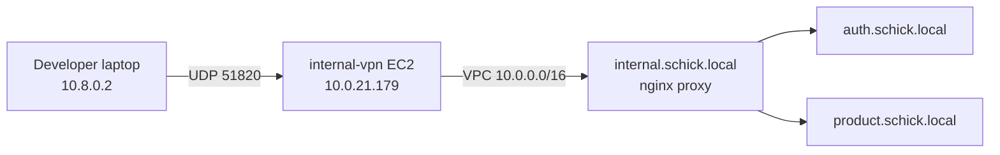

# VPN access to Schick internal API

Production backend APIs run in **private ECS subnets** and are not reachable from the public internet. Use the **WireGuard VPN** on the `internal-vpn` EC2 host to reach the internal API gateway.

## Internal API endpoint

| Host | Purpose |
|------|---------|
| `http://internal.schick.local` | **Recommended** internal API gateway (alias to nginx proxy) |
| `http://proxy.schick.local` | Same gateway (Cloud Map name) |
| `http://auth.schick.local:8080` | Auth service direct |
| `http://product.schick.local:8080` | Product service direct |

### Routes (via `internal.schick.local`)

| Path | Service |
|------|---------|
| `GET /gateway/health` | Proxy health |
| `GET /health` | Auth health |
| `/api/v1/auth/*` | Auth API |
| `/api/*` | Product API |

Example:

```bash
curl http://internal.schick.local/gateway/health
curl http://internal.schick.local/health
```

## VPN server

| Setting | Value |
|---------|-------|
| Instance | `internal-vpn` (`i-0f7a516c42a8b7afd`) |
| Protocol | WireGuard (UDP **51820**) |
| Client pool | `10.8.0.0/24` |
| VPC DNS | `10.0.0.2` (required for `*.schick.local`) |

## One-time infrastructure setup

```bash
cd infra/terraform
terraform apply   # VPN SG rules, VPC route, internal.schick.local DNS, Secrets Manager secret

bash infra/scripts/bootstrap-internal-vpn.sh
```

`bootstrap-internal-vpn.sh` configures WireGuard on the EC2 host and uploads the client config to Secrets Manager.

## Get your client config

```bash
aws secretsmanager get-secret-value \
  --secret-id schick/production/vpn/client-config \
  --query SecretString \
  --output text > schick-vpn.conf
```

## Connect

### macOS / Linux

```bash
sudo wg-quick up ./schick-vpn.conf
curl http://internal.schick.local/gateway/health
```

### Disconnect

```bash
sudo wg-quick down ./schick-vpn.conf
```

### WireGuard app (Windows / mobile)

Import `schick-vpn.conf` into the WireGuard app and activate the tunnel.

## How it works



1. Your machine joins the `10.8.0.0/24` WireGuard network.
2. Traffic to `10.0.0.0/16` is routed through the VPN server into `web-prod-vpc`.
3. VPC DNS (`10.0.0.2`) resolves `internal.schick.local` and other `*.schick.local` hosts.
4. ECS security groups allow HTTP from WireGuard clients to the private services.

## Add another VPN client

SSH to the VPN host and add a peer:

```bash
sudo wg genkey | tee client2.key | wg pubkey > client2.pub
sudo wg set wg0 peer "$(cat client2.pub)" allowed-ips 10.8.0.3/32
```

Issue a client config with `Address = 10.8.0.3/32` and the same server peer block.

## Troubleshooting

| Symptom | Check |
|---------|-------|
| Tunnel up but DNS fails | Client config must include `DNS = 10.0.0.2` |
| DNS works but HTTP times out | Run `terraform apply` for ECS/VPN security group rules |
| Cannot connect to VPN | UDP 51820 open on VPN security group; correct public IP in `Endpoint` |
| `internal.schick.local` NXDOMAIN | Route53 record from `infra/terraform/vpn.tf` applied |

## Security notes

- Restrict VPN UDP ingress to known office/home IPs when possible (edit `vpn.tf` `cidr_blocks`).
- Rotate client keys periodically.
- SSH on the VPN host is currently open to the world — prefer SSM Session Manager and tighten port 22.
